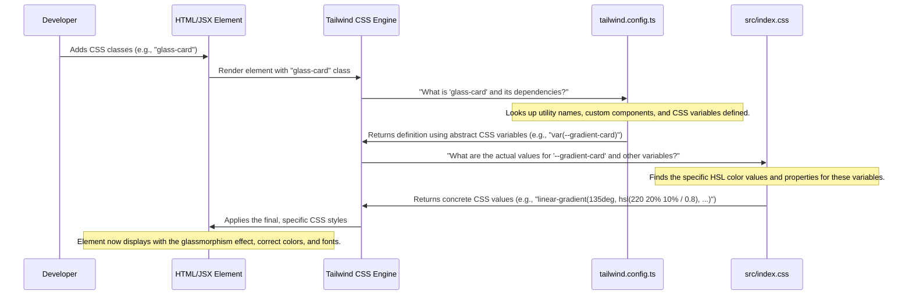

# Chapter 1: Theming & Glassmorphism Styling

Welcome to the CLOZET project! In this first chapter, we're going to dive into what makes CLOZET look so unique and futuristic: its **Theming & Glassmorphism Styling**.

Imagine you're building a brand new store, but instead of a regular brick-and-mortar shop, it's a high-tech boutique in a cyberpunk city. You wouldn't just use plain white walls and boring signs, right? You'd want glowing neon lights, sleek transparent surfaces, and a dark, moody atmosphere.

This is exactly the problem we're solving with CLOZET's styling. We want to give the entire app a "futuristic cinematic" aesthetic, like something out of a science fiction movie. Our goal is to make every button, every card, and every piece of text feel like it belongs in this advanced digital world.

Let's start with a concrete example: How do we make a simple button or a display card look like it's from the future, with a cool translucent effect and a subtle glow? This chapter will guide you through understanding the building blocks of CLOZET's visual identity.

### What is Theming?

Think of theming as choosing the personality and wardrobe for your app. It involves defining:

*   **Colors:** What are the primary, secondary, and accent colors? Are they bright, dark, neon?
*   **Fonts:** What type of typeface will you use? Is it modern, classic, blocky?
*   **Spacing & Sizes:** How much space is between elements? How big are headings versus body text?
*   **Animations:** How do things move and transition on the screen?

CLOZET's theme is **dark, neon, and futuristic**. We use a lot of dark backgrounds, bright "neon" colors like cyan, purple, and magenta for highlights, and sleek, modern fonts.

### What is Glassmorphism?

This is a fancy word for a cool visual effect! Glassmorphism makes UI elements look like they are made of frosted, translucent glass.
Imagine looking through a slightly foggy window – you can see what's behind it, but it's blurred, and the window itself might have a subtle shimmer.

In CLOZET, glassmorphism is used to create interactive elements like cards and menus. They look like floating panels, partially revealing the background beneath them, adding to that high-tech, layered feel.

### What is Tailwind CSS?

Tailwind CSS is like a giant toolbox full of tiny, ready-to-use style pieces. Instead of writing custom CSS for every single element, you combine small utility classes directly in your HTML.

For example, to make text bold, you'd add `font-bold`. To give an element a dark background, you'd add `bg-gray-900`. This makes styling very fast and consistent, as you're always using predefined values from your theme.

### Why a Dark Theme and Neon Glows?

A dark theme is crucial for CLOZET's "futuristic cinematic" vibe. It creates a rich backdrop for the vibrant neon colors to pop. The neon glows add an interactive and dynamic feel, making elements appear powered and alive, much like the glowing interfaces you see in sci-fi movies.

---

### Making a Futuristic Card: Our Use Case

Let's see how these concepts come together to create a simple, futuristic glass card in CLOZET.

Imagine you want a `div` element to represent a product card. We'll give it the signature glassmorphism effect and a rounded border.

```html
<div class="glass-card rounded-xl p-6 text-foreground">
  <h2 class="font-display text-2xl mb-2">Futuristic Gadget</h2>
  <p class="font-body text-sm text-muted-foreground">
    Experience the next generation of tech.
  </p>
  <button class="btn-hero mt-4">Learn More</button>
</div>
```

**What's happening here?**

*   `glass-card`: This is a special utility class we've created in CLOZET that applies all the glassmorphism magic (translucent background, blur, subtle border, shadow).
*   `rounded-xl`: Rounds the corners of the card nicely.
*   `p-6`: Adds padding around the content inside the card.
*   `text-foreground`: Sets the default text color to our theme's main foreground color.
*   `font-display`, `text-2xl`, `mb-2`: Styles the heading using our special display font, a larger size, and a bottom margin.
*   `font-body`, `text-sm`, `text-muted-foreground`: Styles the paragraph with our body font, a smaller size, and a muted text color.
*   `btn-hero`: This is another custom class for a vibrant, glowing button that perfectly matches CLOZET's aesthetic.
*   `mt-4`: Adds a top margin to separate the button from the text.

The result is a card that immediately looks like it belongs in the CLOZET app, showcasing the translucent glass effect and the distinct font styles.

---

### How CLOZET's Styling Works Under the Hood

To truly understand CLOZET's styling, let's peek behind the curtain. When you add a class like `glass-card` or `btn-hero`, how does Tailwind CSS know what styles to apply?

Here's a simplified sequence of what happens:



This diagram shows that two main files work together to define CLOZET's look:

1.  `tailwind.config.ts`: This file is like the *blueprint* or *design language* for Tailwind. It tells Tailwind about all the custom colors, fonts, shadows, and animations we want to use. It defines *how* these elements are named and structured.
2.  `src/index.css`: This file is where we define the *actual values* for our theme. It holds the specific color codes (using HSL for consistency), gradients, and the custom CSS for our `glassmorphism` utilities and special components like `btn-hero`.

Let's look at some simplified code snippets from these files.

#### `tailwind.config.ts` - Defining the Blueprint

This file extends Tailwind's default settings with CLOZET's specific design elements.

```typescript
// --- File: tailwind.config.ts ---
import type { Config } from "tailwindcss";

export default {
  // ... other configurations ...
  theme: {
    extend: {
      colors: {
        background: "hsl(var(--background))",
        foreground: "hsl(var(--foreground))",
        primary: {
          DEFAULT: "hsl(var(--primary))",
          foreground: "hsl(var(--primary-foreground))",
          glow: "hsl(var(--primary-glow))",
        },
        card: {
          DEFAULT: "hsl(var(--card))",
          foreground: "hsl(var(--card-foreground))",
          glass: "hsl(var(--card-glass))", // Our glass color
        },
      },
      fontFamily: {
        sans: ["Space Grotesk", "system-ui", "sans-serif"],
        display: ["Orbitron", "Space Grotesk", "monospace"], // Futuristic display font
        body: ["Space Grotesk", "system-ui", "sans-serif"],
      },
      backgroundImage: {
        'gradient-card': 'var(--gradient-card)', // A custom gradient for glass cards
      },
      boxShadow: {
        'glow-primary': 'var(--glow-primary)', // Neon glow effect
      },
      // ... custom animations like 'float', 'glow', 'slide-up' are defined here ...
    },
  },
  plugins: [require("tailwindcss-animate")],
} satisfies Config;
```

**Explanation:**

*   **`colors`**: We define custom color names like `primary` and `card-glass`. Notice they are defined using `hsl(var(--some-variable))`. This means the actual color value comes from a CSS variable (like `--primary` or `--card-glass`), which is defined in our `src/index.css`. This is a powerful way to make our theme flexible!
*   **`fontFamily`**: We specify our futuristic fonts, `Space Grotesk` for general text (`sans` and `body`) and `Orbitron` for display headings (`display`).
*   **`backgroundImage` & `boxShadow`**: We link these to CSS variables like `--gradient-card` and `--glow-primary`. This allows us to use classes like `bg-gradient-card` or `shadow-glow-primary` directly in our HTML.
*   **`keyframes` & `animation`**: These define how elements move. For example, `glow` will create a pulsating neon effect.

#### `src/index.css` - Providing the Details

This file is where the actual values for our theme variables and custom CSS are declared.

```css
/* --- File: src/index.css --- */
@tailwind base;
@tailwind components;
@tailwind utilities;

/* CLOZET Design System - Ultra-Futuristic Cinematic UI */

@layer base {
  :root {
    /* Dark theme base */
    --background: 220 27% 8%; /* Very dark blue */
    --foreground: 220 9% 97%; /* Off-white for text */

    /* Glass morphism cards */
    --card: 220 20% 10%;
    --card-foreground: 220 9% 97%;
    --card-glass: 220 20% 15%; /* The base color for glass elements */

    /* Neon primary - Cyan */
    --primary: 189 100% 60%; /* Bright cyan */
    --primary-glow: 189 100% 70%; /* Slightly brighter cyan for glow */

    /* Glassmorphism gradients */
    --gradient-card: linear-gradient(135deg, hsl(220 20% 10% / 0.8), hsl(220 20% 15% / 0.4));
    
    /* Neon glows */
    --glow-primary: 0 0 20px hsl(189 100% 60% / 0.5); /* Shadow for primary glow */

    /* Advanced Glassmorphism */
    --glass-ultra: rgba(255, 255, 255, 0.05); /* Transparent white for glass */
    --backdrop-blur-strong: blur(20px); /* How much blur for the glass effect */
  }

  body {
    @apply bg-background text-foreground antialiased;
    background: var(--gradient-hero); /* Apply a hero gradient to the body */
    min-height: 100vh;
    font-family: 'Space Grotesk', -apple-system, BlinkMacSystemFont, sans-serif;
  }

  /* Custom Glassmorphism utilities */
  .glass-card {
    background: linear-gradient(135deg, rgba(255, 255, 255, 0.05) 0%, rgba(255, 255, 255, 0.02) 100%);
    backdrop-filter: blur(20px) saturate(180%);
    border: 1px solid rgba(255, 255, 255, 0.1);
    box-shadow: 0 8px 32px 0 rgba(0, 0, 0, 0.4);
  }
}

@layer components {
  /* Button variants using design system */
  .btn-hero {
    @apply bg-gradient-to-r from-primary to-secondary text-primary-foreground;
    @apply hover:glow-primary transition-all duration-300;
    /* ... other button styles ... */
  }
}
```

**Explanation:**

*   **`:root` variables**: This is the heart of our theme. We define all our custom CSS variables (starting with `--`). For example:
    *   `--background` and `--foreground` set the main app colors.
    *   `--primary` defines our bright cyan neon color.
    *   `--card-glass` is a specific color for glass elements.
    *   `--gradient-card` and `--glow-primary` define the actual gradient and shadow values.
    *   Notice the HSL (Hue, Saturation, Lightness) format, like `220 27% 8%`. This is a modern way to define colors that's easy to adjust and ensures consistency.
*   **`body` styles**: We apply global styles to the `body`, ensuring it uses our dark background gradient and `Space Grotesk` font.
*   **`.glass-card`**: This is a custom utility class defined right here. It uses a `linear-gradient` with `rgba` colors (which include transparency), `backdrop-filter: blur(...)` for the frosted effect, a subtle `border`, and a `box-shadow`. This is the magic behind the glass look!
*   **`.btn-hero`**: This custom component class combines multiple Tailwind utilities and our custom glow and gradient variables to create a distinct, glowing button.

By separating the definition of *what* a color or a font is (`tailwind.config.ts`) from its *specific value* (`src/index.css`), CLOZET's theme is incredibly organized and easy to modify.

---

### Conclusion

In this chapter, we've explored the foundational concepts behind CLOZET's captivating "futuristic cinematic" aesthetic. We learned about:

*   **Theming**: Defining the app's visual personality through colors, fonts, and overall style.
*   **Glassmorphism**: Creating beautiful, translucent, frosted-glass effects that make UI elements feel layered and advanced.
*   **Tailwind CSS**: Using a utility-first framework to efficiently apply our custom design language.
*   The interplay between `tailwind.config.ts` (the blueprint) and `src/index.css` (the detailed values) to bring this unique look to life.

Understanding these styling principles is crucial as we build out the CLOZET app. This consistent design language ensures that every part of the application feels cohesive and deeply immersive.

Next, we'll dive into how CLOZET builds its user interface components using a powerful library called [Shadcn UI Component Library](02_shadcn_ui_component_library_.md), which works hand-in-hand with our custom theme.

---
