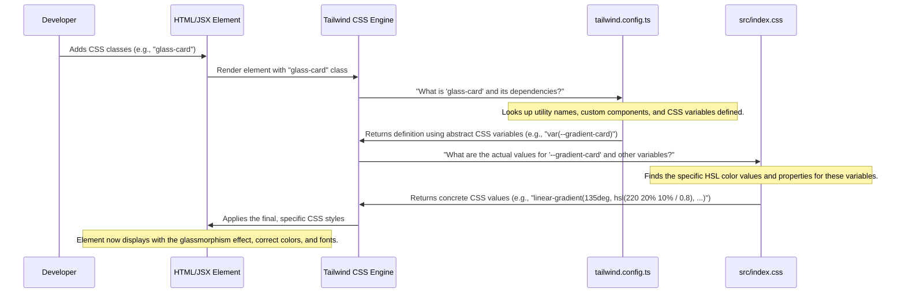
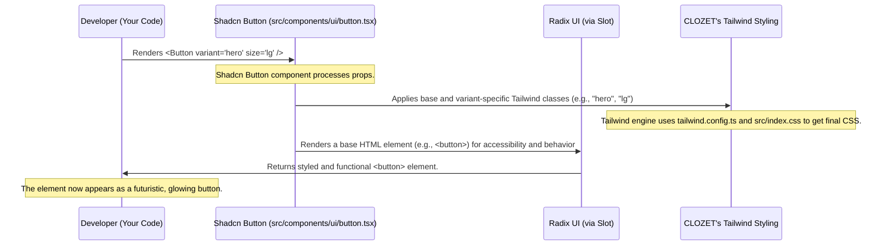
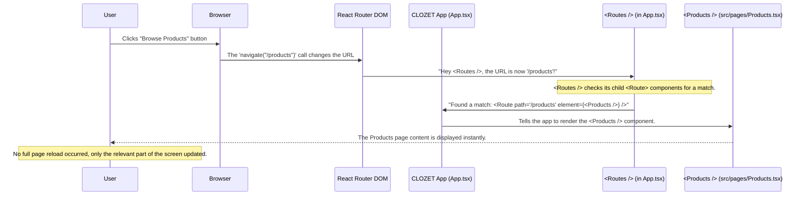
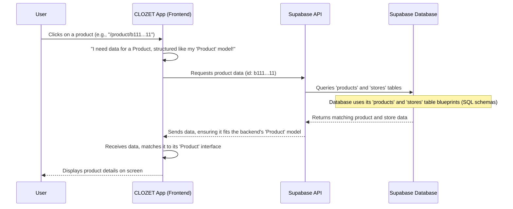
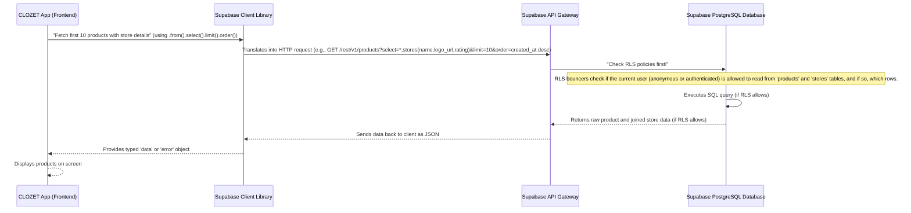
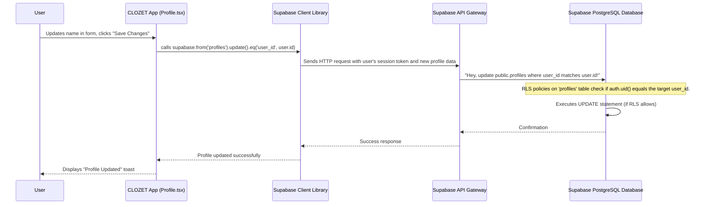

# Tutorial: clozet

CLOZET is an *ultra-futuristic e-commerce platform* that redefines online fashion shopping. It allows users to **securely browse and purchase a wide range of fashion products**, manage their personal profiles and preferences, and even experience innovative features like *AI virtual try-ons*. The project combines a cutting-edge design with robust backend data management and serverless functionality

## Chapters

1. [Theming & Glassmorphism Styling
](01_theming___glassmorphism_styling_.md)
2. [Shadcn UI Component Library
](02_shadcn_ui_component_library_.md)
3. [Frontend Routing
](03_frontend_routing_.md)
4. [E-commerce Core Data Models
](04_e_commerce_core_data_models_.md)
5. [Supabase Data Layer
](05_supabase_data_layer_.md)
6. [Authentication & User Sessions
](06_authentication___user_sessions_.md)
7. [User Profile & Preferences Management
](07_user_profile___preferences_management_.md)
8. [Supabase Edge Functions (Serverless APIs)
](08_supabase_edge_functions__serverless_apis__.md)

---

# Chapter 1: Theming & Glassmorphism Styling

Welcome to the CLOZET project! In this first chapter, we're going to dive into what makes CLOZET look so unique and futuristic: its **Theming & Glassmorphism Styling**.

Imagine you're building a brand new store, but instead of a regular brick-and-mortar shop, it's a high-tech boutique in a cyberpunk city. You wouldn't just use plain white walls and boring signs, right? You'd want glowing neon lights, sleek transparent surfaces, and a dark, moody atmosphere.

This is exactly the problem we're solving with CLOZET's styling. We want to give the entire app a "futuristic cinematic" aesthetic, like something out of a science fiction movie. Our goal is to make every button, every card, and every piece of text feel like it belongs in this advanced digital world.

Let's start with a concrete example: How do we make a simple button or a display card look like it's from the future, with a cool translucent effect and a subtle glow? This chapter will guide you through understanding the building blocks of CLOZET's visual identity.

### What is Theming?

Think of theming as choosing the personality and wardrobe for your app. It involves defining:

*   **Colors:** What are the primary, secondary, and accent colors? Are they bright, dark, neon?
*   **Fonts:** What type of typeface will you use? Is it modern, classic, blocky?
*   **Spacing & Sizes:** How much space is between elements? How big are headings versus body text?
*   **Animations:** How do things move and transition on the screen?

CLOZET's theme is **dark, neon, and futuristic**. We use a lot of dark backgrounds, bright "neon" colors like cyan, purple, and magenta for highlights, and sleek, modern fonts.

### What is Glassmorphism?

This is a fancy word for a cool visual effect! Glassmorphism makes UI elements look like they are made of frosted, translucent glass.
Imagine looking through a slightly foggy window – you can see what's behind it, but it's blurred, and the window itself might have a subtle shimmer.

In CLOZET, glassmorphism is used to create interactive elements like cards and menus. They look like floating panels, partially revealing the background beneath them, adding to that high-tech, layered feel.

### What is Tailwind CSS?

Tailwind CSS is like a giant toolbox full of tiny, ready-to-use style pieces. Instead of writing custom CSS for every single element, you combine small utility classes directly in your HTML.

For example, to make text bold, you'd add `font-bold`. To give an element a dark background, you'd add `bg-gray-900`. This makes styling very fast and consistent, as you're always using predefined values from your theme.

### Why a Dark Theme and Neon Glows?

A dark theme is crucial for CLOZET's "futuristic cinematic" vibe. It creates a rich backdrop for the vibrant neon colors to pop. The neon glows add an interactive and dynamic feel, making elements appear powered and alive, much like the glowing interfaces you see in sci-fi movies.

---

### Making a Futuristic Card: Our Use Case

Let's see how these concepts come together to create a simple, futuristic glass card in CLOZET.

Imagine you want a `div` element to represent a product card. We'll give it the signature glassmorphism effect and a rounded border.

```html
<div class="glass-card rounded-xl p-6 text-foreground">
  <h2 class="font-display text-2xl mb-2">Futuristic Gadget</h2>
  <p class="font-body text-sm text-muted-foreground">
    Experience the next generation of tech.
  </p>
  <button class="btn-hero mt-4">Learn More</button>
</div>
```

**What's happening here?**

*   `glass-card`: This is a special utility class we've created in CLOZET that applies all the glassmorphism magic (translucent background, blur, subtle border, shadow).
*   `rounded-xl`: Rounds the corners of the card nicely.
*   `p-6`: Adds padding around the content inside the card.
*   `text-foreground`: Sets the default text color to our theme's main foreground color.
*   `font-display`, `text-2xl`, `mb-2`: Styles the heading using our special display font, a larger size, and a bottom margin.
*   `font-body`, `text-sm`, `text-muted-foreground`: Styles the paragraph with our body font, a smaller size, and a muted text color.
*   `btn-hero`: This is another custom class for a vibrant, glowing button that perfectly matches CLOZET's aesthetic.
*   `mt-4`: Adds a top margin to separate the button from the text.

The result is a card that immediately looks like it belongs in the CLOZET app, showcasing the translucent glass effect and the distinct font styles.

---

### How CLOZET's Styling Works Under the Hood

To truly understand CLOZET's styling, let's peek behind the curtain. When you add a class like `glass-card` or `btn-hero`, how does Tailwind CSS know what styles to apply?

Here's a simplified sequence of what happens:



This diagram shows that two main files work together to define CLOZET's look:

1.  `tailwind.config.ts`: This file is like the *blueprint* or *design language* for Tailwind. It tells Tailwind about all the custom colors, fonts, shadows, and animations we want to use. It defines *how* these elements are named and structured.
2.  `src/index.css`: This file is where we define the *actual values* for our theme. It holds the specific color codes (using HSL for consistency), gradients, and the custom CSS for our `glassmorphism` utilities and special components like `btn-hero`.

Let's look at some simplified code snippets from these files.

#### `tailwind.config.ts` - Defining the Blueprint

This file extends Tailwind's default settings with CLOZET's specific design elements.

```typescript
// --- File: tailwind.config.ts ---
import type { Config } from "tailwindcss";

export default {
  // ... other configurations ...
  theme: {
    extend: {
      colors: {
        background: "hsl(var(--background))",
        foreground: "hsl(var(--foreground))",
        primary: {
          DEFAULT: "hsl(var(--primary))",
          foreground: "hsl(var(--primary-foreground))",
          glow: "hsl(var(--primary-glow))",
        },
        card: {
          DEFAULT: "hsl(var(--card))",
          foreground: "hsl(var(--card-foreground))",
          glass: "hsl(var(--card-glass))", // Our glass color
        },
      },
      fontFamily: {
        sans: ["Space Grotesk", "system-ui", "sans-serif"],
        display: ["Orbitron", "Space Grotesk", "monospace"], // Futuristic display font
        body: ["Space Grotesk", "system-ui", "sans-serif"],
      },
      backgroundImage: {
        'gradient-card': 'var(--gradient-card)', // A custom gradient for glass cards
      },
      boxShadow: {
        'glow-primary': 'var(--glow-primary)', // Neon glow effect
      },
      // ... custom animations like 'float', 'glow', 'slide-up' are defined here ...
    },
  },
  plugins: [require("tailwindcss-animate")],
} satisfies Config;
```

**Explanation:**

*   **`colors`**: We define custom color names like `primary` and `card-glass`. Notice they are defined using `hsl(var(--some-variable))`. This means the actual color value comes from a CSS variable (like `--primary` or `--card-glass`), which is defined in our `src/index.css`. This is a powerful way to make our theme flexible!
*   **`fontFamily`**: We specify our futuristic fonts, `Space Grotesk` for general text (`sans` and `body`) and `Orbitron` for display headings (`display`).
*   **`backgroundImage` & `boxShadow`**: We link these to CSS variables like `--gradient-card` and `--glow-primary`. This allows us to use classes like `bg-gradient-card` or `shadow-glow-primary` directly in our HTML.
*   **`keyframes` & `animation`**: These define how elements move. For example, `glow` will create a pulsating neon effect.

#### `src/index.css` - Providing the Details

This file is where the actual values for our theme variables and custom CSS are declared.

```css
/* --- File: src/index.css --- */
@tailwind base;
@tailwind components;
@tailwind utilities;

/* CLOZET Design System - Ultra-Futuristic Cinematic UI */

@layer base {
  :root {
    /* Dark theme base */
    --background: 220 27% 8%; /* Very dark blue */
    --foreground: 220 9% 97%; /* Off-white for text */

    /* Glass morphism cards */
    --card: 220 20% 10%;
    --card-foreground: 220 9% 97%;
    --card-glass: 220 20% 15%; /* The base color for glass elements */

    /* Neon primary - Cyan */
    --primary: 189 100% 60%; /* Bright cyan */
    --primary-glow: 189 100% 70%; /* Slightly brighter cyan for glow */

    /* Glassmorphism gradients */
    --gradient-card: linear-gradient(135deg, hsl(220 20% 10% / 0.8), hsl(220 20% 15% / 0.4));
    
    /* Neon glows */
    --glow-primary: 0 0 20px hsl(189 100% 60% / 0.5); /* Shadow for primary glow */

    /* Advanced Glassmorphism */
    --glass-ultra: rgba(255, 255, 255, 0.05); /* Transparent white for glass */
    --backdrop-blur-strong: blur(20px); /* How much blur for the glass effect */
  }

  body {
    @apply bg-background text-foreground antialiased;
    background: var(--gradient-hero); /* Apply a hero gradient to the body */
    min-height: 100vh;
    font-family: 'Space Grotesk', -apple-system, BlinkMacSystemFont, sans-serif;
  }

  /* Custom Glassmorphism utilities */
  .glass-card {
    background: linear-gradient(135deg, rgba(255, 255, 255, 0.05) 0%, rgba(255, 255, 255, 0.02) 100%);
    backdrop-filter: blur(20px) saturate(180%);
    border: 1px solid rgba(255, 255, 255, 0.1);
    box-shadow: 0 8px 32px 0 rgba(0, 0, 0, 0.4);
  }
}

@layer components {
  /* Button variants using design system */
  .btn-hero {
    @apply bg-gradient-to-r from-primary to-secondary text-primary-foreground;
    @apply hover:glow-primary transition-all duration-300;
    /* ... other button styles ... */
  }
}
```

**Explanation:**

*   **`:root` variables**: This is the heart of our theme. We define all our custom CSS variables (starting with `--`). For example:
    *   `--background` and `--foreground` set the main app colors.
    *   `--primary` defines our bright cyan neon color.
    *   `--card-glass` is a specific color for glass elements.
    *   `--gradient-card` and `--glow-primary` define the actual gradient and shadow values.
    *   Notice the HSL (Hue, Saturation, Lightness) format, like `220 27% 8%`. This is a modern way to define colors that's easy to adjust and ensures consistency.
*   **`body` styles**: We apply global styles to the `body`, ensuring it uses our dark background gradient and `Space Grotesk` font.
*   **`.glass-card`**: This is a custom utility class defined right here. It uses a `linear-gradient` with `rgba` colors (which include transparency), `backdrop-filter: blur(...)` for the frosted effect, a subtle `border`, and a `box-shadow`. This is the magic behind the glass look!
*   **`.btn-hero`**: This custom component class combines multiple Tailwind utilities and our custom glow and gradient variables to create a distinct, glowing button.

By separating the definition of *what* a color or a font is (`tailwind.config.ts`) from its *specific value* (`src/index.css`), CLOZET's theme is incredibly organized and easy to modify.

---

### Conclusion

In this chapter, we've explored the foundational concepts behind CLOZET's captivating "futuristic cinematic" aesthetic. We learned about:

*   **Theming**: Defining the app's visual personality through colors, fonts, and overall style.
*   **Glassmorphism**: Creating beautiful, translucent, frosted-glass effects that make UI elements feel layered and advanced.
*   **Tailwind CSS**: Using a utility-first framework to efficiently apply our custom design language.
*   The interplay between `tailwind.config.ts` (the blueprint) and `src/index.css` (the detailed values) to bring this unique look to life.

Understanding these styling principles is crucial as we build out the CLOZET app. This consistent design language ensures that every part of the application feels cohesive and deeply immersive.

Next, we'll dive into how CLOZET builds its user interface components using a powerful library called [Shadcn UI Component Library](02_shadcn_ui_component_library_.md), which works hand-in-hand with our custom theme.

---

# Chapter 2: Shadcn UI Component Library

Welcome back, future fashionista! In [Chapter 1: Theming & Glassmorphism Styling](01_theming___glassmorphism_styling_.md), we laid the groundwork for CLOZET's stunning "futuristic cinematic" look. You learned how our custom dark theme, neon glows, and captivating glassmorphism effects are built using Tailwind CSS and a clever setup in `tailwind.config.ts` and `src/index.css`.

Now, imagine you have all these amazing paint colors and special textures. You wouldn't want to sculpt every single brick and window frame from scratch, right? You'd want some ready-made, stylish building blocks that already match your architectural vision.

This is exactly where the **Shadcn UI Component Library** comes into play for CLOZET. It's a toolbox of pre-built, accessible, and highly customizable user interface (UI) parts that help us build the CLOZET app quickly and ensure everything looks consistently futuristic.

## What Problem Does Shadcn UI Solve?

Building a complex application like CLOZET involves many common UI elements: buttons, input fields, pop-up windows (dialogs), navigation menus, cards for products, and more. If we had to meticulously design and code each of these from the ground up every time, applying our unique glassmorphism and neon styles, it would take a very long time!

Shadcn UI solves this problem by providing a collection of "recipes" for these common UI elements. Instead of building a button's visual style and behavior from zero, we get a solid foundation that we can easily customize with our CLOZET theme. This saves immense development time and ensures a consistent, high-quality user experience.

### Our Use Case: A Futuristic Product Card

Let's consider a practical example: building a product card for CLOZET. We want a card that displays a product, has a title, a description, and a button to add it to the cart. With Shadcn UI, combined with our custom styling from Chapter 1, this becomes surprisingly straightforward.

## What is a UI Component Library?

Think of a UI component library like a collection of high-quality LEGO bricks for your website. Instead of molding each individual plastic piece yourself, you get pre-designed shapes (squares, rectangles, circles, specialized pieces) that you can snap together to build larger structures.

Similarly, in web development, a UI component library gives you ready-to-use pieces like:

*   **Buttons:** For clicking actions.
*   **Input Fields:** For typing text (like search bars).
*   **Cards:** For displaying grouped information (like product details).
*   **Dialogs (Pop-ups):** For important messages or forms.

These components handle common interactions and look good right out of the box, or, in CLOZET's case, after being styled with our futuristic theme.

### What is Shadcn UI Specifically?

Shadcn UI is a bit special. It's not a traditional component library where you install a single package and get all the components. Instead, it's more like a **"collection of customizable code snippets"** or a **"recipe book"**.

When you want a component (like a `Button` or a `Card`), Shadcn UI helps you *add the component's code directly into your project*. This means:

1.  **You own the code:** The component code becomes part of *your* codebase, not locked away in a library. This gives you ultimate control for customization.
2.  **It uses Radix UI for behavior:** For complex components, Shadcn leverages [Radix UI](https://www.radix-ui.com/), a "headless" component library. "Headless" means Radix provides all the accessibility, keyboard navigation, and state management (like "is a dialog open or closed?"), but *no visual styling*.
3.  **It uses Tailwind CSS for styling:** Shadcn components come pre-configured with Tailwind CSS classes. This is perfect for CLOZET because we already use Tailwind CSS and have our custom theme defined! We can easily override or extend these classes to apply our glassmorphism and neon effects.

This approach gives us the best of both worlds: robust, accessible behavior from Radix, and complete styling flexibility with Tailwind CSS, all managed within our own project.

## Using Shadcn UI for a Product Card

Let's see how we would use Shadcn UI components to build a futuristic product card. Remember, in CLOZET, we've already defined our dark theme, neon colors, and glassmorphism in [Chapter 1: Theming & Glassmorphism Styling](01_theming___glassmorphism_styling_.md). Shadcn components seamlessly adopt these styles.

First, we would have added the `Card` and `Button` components to our project using the Shadcn CLI (Command Line Interface). This creates files like `src/components/ui/card.tsx` and `src/components/ui/button.tsx`.

Now, in our React code (e.g., in a page or another component), we can import and use them:

```tsx
import { Card, CardHeader, CardTitle, CardDescription, CardContent, CardFooter } from "@/components/ui/card";
import { Button } from "@/components/ui/button";

function ProductCard() {
  return (
    // Our custom glass-card class from Chapter 1 applied here!
    <Card className="glass-card rounded-xl p-6">
      <CardHeader>
        <CardTitle className="font-display text-2xl text-primary-glow">Cybernetic Visor</CardTitle>
        <CardDescription className="text-muted-foreground">
          Experience enhanced reality with real-time data overlays.
        </CardDescription>
      </CardHeader>
      <CardContent className="text-lg font-bold text-foreground">
        $1,999.99
      </CardContent>
      <CardFooter>
        <Button variant="hero" size="lg" className="w-full">
          Add to Cart
        </Button>
      </CardFooter>
    </Card>
  );
}

export default ProductCard;
```

**What's happening here?**

*   We import `Card`, `CardHeader`, `CardTitle`, `CardDescription`, `CardContent`, `CardFooter`, and `Button` from their respective Shadcn UI component files (`@/components/ui/`).
*   The main `Card` component gets our custom `glass-card` class (from Chapter 1) to apply the translucent, frosted effect. It also gets `rounded-xl` and `p-6` for rounded corners and padding.
*   `CardTitle` and `CardDescription` automatically use our theme's fonts and colors, but we can override them with additional Tailwind classes like `font-display`, `text-primary-glow`, and `text-muted-foreground` for a more distinct look.
*   The `Button` component is used with `variant="hero"` and `size="lg"`. These are custom variants and sizes we defined in CLOZET, building on top of Shadcn's foundation. The `hero` variant creates a vibrant, glowing button that perfectly matches our futuristic aesthetic. `w-full` makes it span the full width.

**Output (High-level Description):**

This code will render a beautiful, interactive product card. It will have a translucent, glass-like background (thanks to `glass-card`), a vibrant title with a neon glow, a clear description, the price, and a large, glowing "Add to Cart" button that changes subtly when hovered, just like in a high-tech sci-fi store!

## Under the Hood: How Shadcn UI Components Work

Let's peek behind the curtain to understand how Shadcn components seamlessly integrate with CLOZET's unique theme.

### The Component Flow

When you use a Shadcn component like `<Button>` in CLOZET, here's a simplified sequence of what happens:



1.  **You use the component**: You add `<Button variant="hero">` in your React code.
2.  **Shadcn component code**: This call goes to the `Button` component file (`src/components/ui/button.tsx`) that Shadcn helped you add to your project.
3.  **Styling with `cva` and `cn`**: The `Button` component uses special utilities like `cva` (class-variance-authority) and `cn` (a small helper for combining Tailwind classes) to intelligently apply Tailwind classes based on the `variant` and `size` props you provided. This is where our custom `hero` variant, defined in [Chapter 1: Theming & Glassmorphism Styling](01_theming___glassmorphism_styling_.md) through `tailwind.config.ts` and `src/index.css`, gets its instructions.
4.  **Behavior with Radix UI (`Slot`)**: For robust accessibility and interaction, many Shadcn components use `Slot` from Radix UI. This allows the component to render a simple HTML element (like `<button>`) while inheriting all the accessibility features (like keyboard navigation) from Radix, without adding any visual styles.
5.  **Final Render**: The browser renders a standard HTML button, but it has all the specific Tailwind CSS classes from our CLOZET theme applied, making it look like a glowing, futuristic component.

### Code Deep Dive: `button.tsx` and `components.json`

Let's look at simplified versions of the actual code that makes this work.

#### `src/components/ui/button.tsx` - The Heart of the Component

This file defines how our `Button` component behaves and gets its styles.

```typescript
// --- File: src/components/ui/button.tsx ---
import { Slot } from "@radix-ui/react-slot";
import { cva, type VariantProps } from "class-variance-authority"; // Helps manage Tailwind classes

import { cn } from "@/lib/utils"; // Utility to combine class names

// 1. Define button styles using cva
const buttonVariants = cva(
  "inline-flex items-center justify-center ... focus-visible:ring-2 ... disabled:opacity-50", // Base styles
  {
    variants: {
      variant: {
        // Standard Shadcn variants
        default: "bg-primary text-primary-foreground hover:bg-primary/90",
        // CLOZET futuristic variants (linked to our theme from Chapter 1)
        hero: "bg-gradient-primary text-primary-foreground hover:shadow-glow-primary transition-all",
        glass: "glass hover:glass-strong text-foreground border-0 backdrop-blur-md",
        neon: "bg-gradient-to-r from-primary to-accent text-primary-foreground hover:shadow-glow-accent",
        "outline-neon": "border-2 border-primary bg-transparent text-primary hover:bg-primary",
      },
      size: {
        default: "h-10 px-4 py-2",
        lg: "h-11 rounded-md px-8",
        xl: "h-14 rounded-xl px-10 text-base", // Our custom extra-large size
      },
    },
    defaultVariants: {
      variant: "default",
      size: "default",
    },
  },
);

// 2. The React Button Component
const Button = React.forwardRef<HTMLButtonElement, ButtonProps>(
  ({ className, variant, size, asChild = false, ...props }, ref) => {
    const Comp = asChild ? Slot : "button"; // Use Radix Slot for flexibility or a simple button
    return <Comp className={cn(buttonVariants({ variant, size, className }))} ref={ref} {...props} />;
  },
);
Button.displayName = "Button";

export { Button, buttonVariants };
```

**Explanation:**

1.  **`buttonVariants = cva(...)`**: This is the core. `cva` (class-variance-authority) is a utility that allows us to define different styles based on "variants" (like `variant="hero"`) and "sizes" (like `size="lg"`).
    *   It starts with common base Tailwind classes that apply to all buttons (e.g., `inline-flex`, `items-center`).
    *   Then, under `variants`, it defines specific sets of Tailwind classes for each `variant` (e.g., `default`, `hero`, `glass`, `neon`) and `size` (e.g., `default`, `lg`, `xl`).
    *   Notice how our CLOZET-specific `hero`, `glass`, `neon`, and `outline-neon` variants directly reference the custom colors, gradients, and shadows we set up in our `tailwind.config.ts` and `src/index.css` in [Chapter 1: Theming & Glassmorphism Styling](01_theming___glassmorphism_styling_.md)! This is how Shadcn components "know" about our theme.
2.  **`Button` React Component**: This is the actual React component we import and use.
    *   It takes `className`, `variant`, `size`, and other standard button props.
    *   `const Comp = asChild ? Slot : "button";` allows us to either render a standard `<button>` element or use Radix UI's `Slot` component for more advanced scenarios where you want to wrap the button behavior around a different element.
    *   `className={cn(buttonVariants({ variant, size, className }))}`: This is where the magic happens! The `cn` utility merges all the class names: the base classes, the variant-specific classes (from `buttonVariants` based on `variant` and `size`), and any additional `className` you passed directly. This merged string of Tailwind classes is then applied to the final HTML element.

#### `components.json` - Shadcn's Configuration

This file, located at the root of our project, tells Shadcn UI how it should integrate components into *our* specific project structure and theme.

```json
// --- File: components.json ---
{
  "$schema": "https://ui.shadcn.com/schema.json",
  "style": "default",
  "rsc": false,
  "tsx": true,
  "tailwind": {
    "config": "tailwind.config.ts", // Tells Shadcn where our Tailwind config is
    "css": "src/index.css",         // Where our base CSS and custom variables are
    "baseColor": "slate",           // Default base color (overridden by our theme)
    "cssVariables": true,           // Indicates we use CSS variables (like --primary)
    "prefix": ""
  },
  "aliases": {
    "components": "@/components",   // How to import components (e.g., "@/components/ui/button")
    "utils": "@/lib/utils",
    "ui": "@/components/ui",
    "lib": "@/lib",
    "hooks": "@/hooks"
  }
}
```

**Explanation:**

*   **`tailwind` section**: This is crucial. It points Shadcn to our `tailwind.config.ts` and `src/index.css` files. This means that when Shadcn generates components or when its components look for styling information, they are aware of our CLOZET-specific colors, fonts, shadows, and gradients that we defined in [Chapter 1: Theming & Glassmorphism Styling](01_theming___glassmorphism_styling_.md).
*   **`aliases` section**: This defines convenient shortcuts for importing files. For example, instead of writing `../../components/ui/button`, we can simply write `@/components/ui/button`.

## Conclusion

In this chapter, we explored the power and flexibility of the **Shadcn UI Component Library**. We learned that it's not just another collection of pre-made UI elements, but a highly customizable "recipe book" that integrates perfectly with CLOZET's unique theme.

Key takeaways include:

*   Shadcn UI speeds up development by providing accessible and robust UI components.
*   It gives us full control over the code, making deep customization easy.
*   It leverages Radix UI for component behavior and accessibility, and Tailwind CSS for styling.
*   Our custom CLOZET theme (colors, fonts, glassmorphism, neon glows) seamlessly applies to Shadcn components thanks to the `cva` utility and the integration defined in `components.json`.

With Shadcn UI, we can build the CLOZET app's interface quickly, consistently, and with all the futuristic flair we designed in the previous chapter.

Next, we'll dive into **[Chapter 3: Frontend Routing](03_frontend_routing_.md)**, where we'll learn how users navigate through different sections of our CLOZET app, from browsing products to viewing their cart.

---

# Chapter 3: Frontend Routing

Welcome back, future fashionista! In [Chapter 1: Theming & Glassmorphism Styling](01_theming___glassmorphism_styling_.md), we crafted CLOZET's unique visual identity. Then, in [Chapter 2: Shadcn UI Component Library](02_shadcn_ui_component_library_.md), we learned how to use pre-built, customizable UI components that flawlessly adopt our futuristic theme.

Now, imagine you've stepped into CLOZET's stunning digital boutique. You want to browse products, check your wishlist, or perhaps look at your profile. How do you move between these different sections of the app? Do you need to constantly open new tabs or wait for the entire webpage to reload every time you click something?

This is the problem **Frontend Routing** solves. It's like the app's internal navigation system, guiding you smoothly between different screens and features without needing to reload the entire webpage. This creates a fluid, instant, and modern "single-page application" experience, much like using a desktop app.

### Our Use Case: Seamless Navigation

Let's take a look at our `Wishlist` page. When your wishlist is empty, there's a button that says "Explore Products." Or, if you have items, a "Browse Products" button in the header.

```tsx
// --- Simplified from src/pages/Wishlist.tsx ---
import { useNavigate } from "react-router-dom";
import { Button } from "@/components/ui/button";

const Wishlist = () => {
  const navigate = useNavigate(); // This hook helps us change pages!
  // ... (other state and functions) ...

  return (
    <div>
      {/* ... header content ... */}
      <Button
        variant="ghost"
        onClick={() => navigate("/products")} // Clicking this button takes you to /products
        className="text-muted-foreground hover:text-primary"
      >
        Browse Products
      </Button>

      {/* ... empty wishlist content ... */}
      <Button
        onClick={() => navigate("/products")} // This button also takes you to /products
        size="lg"
      >
        Explore Products
      </Button>
      {/* ... rest of the component ... */}
    </div>
  );
};
```

When you click "Explore Products" or "Browse Products," the app *instantly* switches to the `/products` page. The browser's URL changes, but the whole page doesn't blink or reload. How does CLOZET know which screen to show for `/products`? That's the magic of frontend routing!

## What is Frontend Routing?

Think of your CLOZET app as a magnificent digital city. Each page, like the "Dashboard," "Products," or "Wishlist," is a unique district in this city. Frontend routing provides:

*   **Addresses (URLs):** These are like street addresses for each district (e.g., `/dashboard`, `/products`).
*   **A Map (Router):** This map knows which district corresponds to which address.
*   **Roads (Navigation):** These are the paths you take to move between districts without having to leave the city and come back in (no full page reloads!).

Specifically, for CLOZET, we use a popular library called **React Router DOM**. It helps our React application understand URLs and display the correct "page component" for each.

### Key Concepts in Routing

Here are the main ideas we need to grasp for CLOZET's navigation:

1.  **`Route`:** A single entry on our app's map. It connects a specific URL path (like `/products`) to a React component (like the `Products` page component).
2.  **`Routes`:** This is like the central directory for all our `Route` entries. It listens to the browser's URL and finds the best `Route` match.
3.  **`BrowserRouter`:** This is the main engine of our navigation system. It tells our app to "pay attention" to changes in the browser's URL. It wraps our entire application's routes.
4.  **`Link`:** This is the primary way to create navigation buttons or text that take you to a different `Route` when clicked. It's similar to a standard HTML `<a>` tag but designed for React Router.
5.  **`useNavigate` Hook:** This is a special tool for when you need to navigate programmatically (e.g., after a form submission, or when a button click has some logic before navigating).

## How CLOZET Uses Frontend Routing

All of CLOZET's routing configuration lives primarily in the `src/App.tsx` file. This is where we define the entire "map" of our application.

Let's look at how we define some routes in `App.tsx`:

```tsx
// --- Simplified from src/App.tsx ---
import { BrowserRouter, Routes, Route, Navigate } from "react-router-dom";
import Dashboard from "./pages/Dashboard";
import Products from "./pages/Products";
import ProductDetail from "./pages/ProductDetail"; // For individual product pages
import Wishlist from "./pages/Wishlist";
import NotFound from "./pages/NotFound"; // For unmatched URLs
import { ProtectedRoute } from "@/components/ProtectedRoute"; // We'll learn more about this later!

const App = () => (
  <BrowserRouter> {/* 1. The main navigation manager */}
    <Routes> {/* 2. The container for all our specific paths */}

      {/* 3. Define individual routes */}
      <Route path="/" element={<Navigate to="/dashboard" replace />} /> {/* Redirects home to dashboard */}

      <Route
        path="/dashboard"
        element={
          <ProtectedRoute> {/* This wraps our Dashboard, ensuring authentication */}
            <Dashboard />
          </ProtectedRoute>
        }
      />
      
      <Route path="/products" element={<Products />} /> {/* Our products listing */}
      <Route path="/product/:id" element={<ProductDetail />} /> {/* A single product's detail page */}
      <Route path="/wishlist" element={<ProtectedRoute><Wishlist /></ProtectedRoute>} /> {/* User's wishlist */}

      <Route path="*" element={<NotFound />} /> {/* 4. Catch-all for unknown URLs */}
    </Routes>
  </BrowserRouter>
);

export default App;
```

**Explanation of the `App.tsx` snippet:**

1.  **`<BrowserRouter>`**: We wrap our entire application's content (specifically, the part that needs routing) with `<BrowserRouter>`. This component sets up the routing mechanism that listens to browser URL changes.
2.  **`<Routes>`**: Inside `BrowserRouter`, we use `<Routes>` to group all our individual `Route` definitions. `Routes` intelligently picks the *best* matching `Route` for the current URL.
3.  **`<Route>`**: Each `<Route>` component defines a mapping:
    *   **`path`**: This is the URL segment that this route will match.
        *   `path="/"`: Matches the root URL of our app.
        *   `path="/dashboard"`: Matches the URL `yourwebsite.com/dashboard`.
        *   `path="/product/:id"`: This is a **dynamic route**. The `:id` part is a placeholder. It means any value in that position (e.g., `/product/123` or `/product/abc`) will match this route, and the "id" value (`123` or `abc`) can be extracted by the `ProductDetail` component.
        *   `path="/products"`: Matches `yourwebsite.com/products`.
    *   **`element`**: This is the React component that will be rendered when the `path` matches.
        *   `element={<Navigate to="/dashboard" replace />}`: This is a special `Route` that doesn't render a component directly. Instead, it immediately redirects the user from `/` to `/dashboard`.
        *   `element={<Products />}`: When the URL is `/products`, the `Products` component is shown.
        *   `element={<ProtectedRoute><Dashboard /></ProtectedRoute>}`: Here, the `Dashboard` component is rendered, but it's wrapped inside a `ProtectedRoute`. For now, just know `ProtectedRoute` is another component that helps manage who can see the `Dashboard` (e.g., only logged-in users). We'll dive into authentication in [Chapter 6: Authentication & User Sessions](06_authentication___user_sessions_.md).
4.  **`path="*"`**: This is a special "catch-all" route. If no other `path` matches the current URL, this `Route` will be triggered, and our `NotFound` component will be displayed, showing a friendly "Page Not Found" message.

### Navigating with `Link` and `useNavigate`

Now that we have our map defined, let's see how we use the "roads" to move around.

**1. Using `Link` for simple navigation:**

The `<Link>` component is perfect for navigation where you want to go directly to a known path.

```tsx
// --- Simplified from src/pages/ProductDetail.tsx ---
import { Link, useParams } from "react-router-dom"; // Import Link
import { Button } from "@/components/ui/button";

const ProductDetail = () => {
  const { id } = useParams(); // How we get the dynamic 'id' from the URL!

  return (
    <header>
      <Link to="/products" className="flex items-center space-x-2"> {/* This creates a clickable link */}
        {/* ... icon and text ... */}
        <span>Back to Products</span>
      </Link>
      {/* ... other header content ... */}
    </header>
    // ... rest of the component
  );
};
```

**Explanation:**

*   **`<Link to="/products">`**: This component will render an HTML `<a>` tag in the browser, but when clicked, React Router DOM intercepts the click and changes the URL to `/products` without a full page reload.
*   **`useParams()`**: For dynamic routes like `/product/:id`, the `useParams()` hook is essential. It allows our `ProductDetail` component to extract the actual `id` value (e.g., "123") from the URL.

**2. Using `useNavigate` for programmatic navigation:**

Sometimes, you need to perform some logic *before* navigating, or navigate based on an event that isn't just a simple click (like a form submission). That's where the `useNavigate` hook comes in handy, as seen in our `Wishlist.tsx` example.

```tsx
// --- Simplified from src/pages/Wishlist.tsx ---
import { useNavigate } from "react-router-dom"; // Import useNavigate
import { Button } from "@/components/ui/button";

const Wishlist = () => {
  const navigate = useNavigate(); // Get the navigate function

  // ... (some other functions, e.g., after an action completes) ...
  const handleCheckout = () => {
    // Perform some logic here, maybe save items to database
    console.log("Proceeding to checkout...");
    navigate("/checkout"); // Now, navigate to the checkout page
  };

  return (
    <div>
      {/* ... a button that uses the navigate function directly ... */}
      <Button onClick={() => navigate("/products")}>
        Browse Products
      </Button>

      {/* ... or a button that calls a function which then navigates ... */}
      <Button onClick={handleCheckout}>
        Proceed to Checkout
      </Button>
    </div>
  );
};
```

**Explanation:**

*   **`const navigate = useNavigate();`**: We call the `useNavigate` hook to get a special function called `navigate`.
*   **`navigate("/products")`**: When called, this `navigate` function changes the browser's URL to `/products`, triggering the router to display the corresponding `Products` component.

## Under the Hood: How Routing Works

Let's see the sequence of events when you interact with CLOZET's navigation system.

Imagine you're on the `/wishlist` page, and you click the "Browse Products" button that calls `navigate("/products")`.



This diagram illustrates how `react-router-dom` acts as a smart traffic controller for your app. Instead of asking the server for a brand new page, it manages which parts of your *existing* loaded application should be visible based on the URL. This is why it feels so fast and seamless!

## Conclusion

In this chapter, we've unlocked the secret to CLOZET's smooth and instant navigation: **Frontend Routing**. We learned:

*   Why routing is essential for creating a modern, single-page application experience.
*   How `react-router-dom` (with `BrowserRouter`, `Routes`, and `Route` components) defines the app's internal map.
*   How to navigate using the declarative `<Link>` component for direct links and the programmatic `useNavigate` hook for more complex navigation flows.
*   The significance of dynamic routes like `/product/:id` for showing specific item details.

With frontend routing, users can explore CLOZET's futuristic store as effortlessly as navigating a highly advanced digital interface.

Next, we'll dive into **[Chapter 4: E-commerce Core Data Models](04_e-commerce_core_data_models_.md)**, where we'll define the fundamental building blocks of CLOZET's data, such as products, categories, and orders.

---

# Chapter 4: E-commerce Core Data Models

Welcome back, future fashionista! In [Chapter 1: Theming & Glassmorphism Styling](01_theming___glassmorphism_styling_.md), we learned how to make CLOZET look stunning. In [Chapter 2: Shadcn UI Component Library](02_shadcn_ui_component_library_.md), we found out how to build beautiful interface pieces. And in [Chapter 3: Frontend Routing](03_frontend_routing_.md), we mastered how to move smoothly between different pages in our app.

Now, imagine you've navigated to the "Products" page, and you see a list of dazzling fashion items. You click on a "Cybernetic Visor" to see its details. Where does all this information — the visor's name, price, description, images, and the store it belongs to — actually come from? And how does CLOZET know what *kind* of information to expect for a product, or a store, or an order?

This is the problem **E-commerce Core Data Models** solve. They are the fundamental blueprints that define what information each main "thing" (or entity) in our shopping platform holds. Without these blueprints, our app wouldn't know how to store or display products, manage stores, or keep track of your orders. It would be like trying to build a complex machine without a design!

### Our Use Case: Displaying Product Details

Let's focus on a concrete example: displaying the details of a single product, like our "Cybernetic Visor." For this page, we need to know:
*   The product's `title` (e.g., "Cybernetic Visor")
*   Its `price` and `mrp` (original price)
*   A list of `images` to show
*   A detailed `description`
*   The `brand` and `category`
*   Which `store` sells it, including the store's `name` and `rating`

To achieve this, we need a clear, agreed-upon structure for `Product` data and `Store` data.

## What Are Data Models?

Think of data models as detailed instruction manuals or blueprints for information. Just like a car manufacturer has blueprints for every part of a car (engine, wheels, seats), CLOZET has blueprints for every important piece of information in its system.

These blueprints define:

*   **What kind of information?** (e.g., "A product has a title, a price, and images.")
*   **What format?** (e.g., "The price is a number, the title is text, images are a list of text links.")
*   **How are things connected?** (e.g., "Each product belongs to one store.")

In an e-commerce app like CLOZET, our most important blueprints (or core data models) are for:

*   **Products:** The items customers buy.
*   **Stores:** The businesses selling products.
*   **Orders:** Records of what customers have bought.

## Why Do We Need Data Models?

Data models are crucial because they ensure:

1.  **Organization:** All product information is stored consistently.
2.  **Clarity:** Both the frontend (what you see) and the backend (where data is stored) agree on what a "product" or "store" looks like.
3.  **Efficiency:** It makes it easier to fetch and display the right information.
4.  **Consistency:** Every product card, every store listing, every order summary looks and behaves predictably.

## How CLOZET Uses Core Data Models

In CLOZET, we define our data models in two main places:

1.  **Frontend (TypeScript Interfaces):** These define the *shape* of the data our React components expect to receive and work with.
2.  **Backend (Database Tables via SQL):** These are the *actual storage structures* in our database, which follow the same blueprint.

Let's look at how our `Product` and `Store` models are used in the `ProductDetail.tsx` page.

### Frontend Data Models (TypeScript Interfaces)

When you look at `src/pages/ProductDetail.tsx`, you'll see an `interface Product` and `interface Store`. These are our TypeScript definitions for what a `Product` and `Store` should contain:

```typescript
// --- Simplified from src/pages/ProductDetail.tsx ---
interface Product {
  id: string;
  title: string;
  description: string;
  price: number;
  mrp: number;
  images: string[];
  brand: string;
  category: string;
  material: string;
  care_instructions: string;
  variants: any; // e.g., [{"size": "S", "color": "Black"}]
  stores: { // This shows a connection to another model!
    id: string;
    name: string;
    rating: number;
    logo_url: string;
  };
}

// The 'stores' part above refers to a structure like this:
// interface Store {
//   id: string;
//   name: string;
//   rating: number;
//   logo_url: string;
// }
```

**Explanation:**

*   This `Product` interface tells our `ProductDetail` component exactly what properties (like `title`, `price`, `images`) it can expect to find in the product data it fetches.
*   Notice how the `Product` interface *includes* a `stores` property, which itself has `id`, `name`, `rating`, and `logo_url`. This shows how different data models can be related – a `Product` is linked to a `Store`.
*   When we fetch data, CLOZET will make sure the data matches this expected shape. If it doesn't, we know something is wrong!

This is how our frontend code can reliably display information: it trusts that the data it receives will fit these predefined shapes.

## Under the Hood: How Data Models Are Defined and Used

Let's trace how these data models work from a user clicking on a product to the details appearing on screen.

### The Data Flow

When a user wants to view a product:



This diagram shows that both our CLOZET app (frontend) and the Supabase database (backend) have a shared understanding of what a "Product" or a "Store" looks like, thanks to these models.

### Backend Data Models (SQL Database Tables)

The real source of truth for our data models is the database schema, defined using SQL (Structured Query Language). In CLOZET, our database definitions are in files like `supabase/migrations/20250920154342_f305632d-37bd-4423-9e23-331d36bf4c4d.sql`.

Here's a simplified look at how the `products` and `stores` tables are created in our database:

```sql
-- --- Simplified from supabase/migrations/...sql ---

-- Blueprint for 'stores'
CREATE TABLE public.stores (
  id UUID PRIMARY KEY,                 -- Unique identifier for the store
  owner_id UUID REFERENCES auth.users(id), -- Who owns this store
  name TEXT NOT NULL,                  -- Store's name (e.g., "CLOZET Fashion Store")
  description TEXT,
  logo_url TEXT,                       -- Link to the store's logo image
  rating DECIMAL(3, 2) DEFAULT 0,      -- Store's average rating
  -- ... many other details like address, location, etc.
  created_at TIMESTAMP WITH TIME ZONE DEFAULT NOW()
);

-- Blueprint for 'products'
CREATE TABLE public.products (
  id UUID PRIMARY KEY,                 -- Unique identifier for the product
  store_id UUID NOT NULL REFERENCES public.stores(id), -- Links to the store it belongs to
  title TEXT NOT NULL,                 -- Product's name (e.g., "Classic White Shirt")
  price DECIMAL(10, 2) NOT NULL,       -- Current selling price
  mrp DECIMAL(10, 2) NOT NULL,         -- Manufacturer's Recommended Price
  images TEXT[] DEFAULT '{}',          -- List of image URLs
  brand TEXT,
  category TEXT NOT NULL,
  variants JSONB DEFAULT '[]',         -- Complex data like colors/sizes
  -- ... many other details like material, care instructions, etc.
  created_at TIMESTAMP WITH TIME ZONE DEFAULT NOW()
);

-- Blueprint for 'orders' (just one example for context)
CREATE TABLE public.orders (
  id UUID PRIMARY KEY,
  order_number TEXT NOT NULL UNIQUE,
  user_id UUID NOT NULL REFERENCES auth.users(id), -- Who placed the order
  store_id UUID NOT NULL REFERENCES public.stores(id), -- Which store received the order
  items JSONB NOT NULL,                -- Details of products bought
  total DECIMAL(10, 2) NOT NULL,       -- Total amount paid
  order_status TEXT DEFAULT 'placed',
  -- ... other order details
  created_at TIMESTAMP WITH TIME ZONE DEFAULT NOW()
);
```

**Explanation:**

*   **`CREATE TABLE`**: This SQL command tells the database to create a new table (like `stores`, `products`, `orders`).
*   **Columns & Types**: Each `(column_name TYPE)` defines a piece of information and its data type (e.g., `id UUID` for a unique ID, `name TEXT` for text, `price DECIMAL` for numbers with decimals).
*   **`PRIMARY KEY`**: This ensures each record in a table has a unique `id`.
*   **`REFERENCES public.stores(id)`**: This is a powerful part! It creates a **relationship**. For example, in the `products` table, `store_id` connects a product to its selling store. This is how we know which store sells which product.
*   **`JSONB`**: For complex data like `variants` in `products` (which might be a list of `size` and `color` options) or `items` in `orders`, we use `JSONB` to store structured JSON data directly in the database.
*   **`TEXT[]`**: This defines an array of text, perfect for storing multiple image URLs.

These SQL definitions are the master blueprints. They ensure that all data stored in CLOZET's database is structured, consistent, and ready to be used by the application.

### Connecting Frontend and Backend Types (`supabase/types.ts`)

To make development smoother and prevent errors, CLOZET uses a special file: `src/integrations/supabase/types.ts`. This file is often automatically generated (or can be manually maintained) to create TypeScript types that *exactly match* our database schema.

This means that the `Product` interface we saw on the frontend (`src/pages/ProductDetail.tsx`) is essentially a friendly, simplified version of the more detailed type generated from the database.

Here's a simplified look at the generated `types.ts` file:

```typescript
// --- Simplified from src/integrations/supabase/types.ts ---
export type Database = {
  public: {
    Tables: {
      products: {
        Row: { // Defines the shape of a row in the 'products' table
          brand: string | null;
          category: string;
          id: string;
          images: string[] | null;
          mrp: number;
          price: number;
          store_id: string; // The link to the store
          title: string;
          variants: Json | null; // Our JSONB variants
          // ... many other fields
        };
        Insert: {}; // How to insert data
        Update: {}; // How to update data
        Relationships: []; // How this table relates to others
      };
      stores: {
        Row: { // Defines the shape of a row in the 'stores' table
          address: string;
          id: string;
          logo_url: string | null;
          name: string;
          owner_id: string;
          rating: number | null;
          // ... many other fields
        };
        Insert: {};
        Update: {};
        Relationships: [];
      };
      orders: {
        Row: { // Defines the shape of a row in the 'orders' table
          id: string;
          order_number: string;
          items: Json;
          store_id: string;
          total: number;
          user_id: string;
          order_status: string | null;
          // ... many other fields
        };
        Insert: {};
        Update: {};
        Relationships: [];
      };
      // ... other tables like cart, wishlist, profiles, etc.
    };
    Views: {};
    Functions: {};
    Enums: {};
    CompositeTypes: {};
  };
};

export type Tables<
  TableName extends keyof Database["public"]["Tables"]
> = Database["public"]["Tables"][TableName]["Row"];

// Now you can easily use it like:
// type ProductRow = Tables<'products'>;
```

**Explanation:**

*   This TypeScript type definition automatically mirrors the structure of our `public.products`, `public.stores`, and `public.orders` tables in the database.
*   `Tables<TableName>` is a helper type that lets us easily get the `Row` type for any table.
*   This strong typing means that when our frontend code fetches data from the database, TypeScript helps us ensure that the data we expect matches what the database provides. This prevents many common bugs!

## Conclusion

In this chapter, we've uncovered the essential role of **E-commerce Core Data Models**. We learned that:

*   Data models are the crucial blueprints that define the structure of information for key entities like `products`, `stores`, and `orders`.
*   They ensure consistency and clarity, both in our frontend application code (through TypeScript interfaces) and in our backend database storage (through SQL table definitions).
*   Understanding these models is fundamental to how CLOZET organizes and displays every piece of information, from a product's price to a store's rating.

With our data models clearly defined, the next logical step is to learn how our application actually *interacts* with the database to fetch and manage this data. This is where **[Chapter 5: Supabase Data Layer](05_supabase_data_layer_.md)** comes in, showing us how CLOZET talks to its powerful cloud database.

---

# Chapter 5: Supabase Data Layer

Welcome back, future fashionista! In [Chapter 1: Theming & Glassmorphism Styling](01_theming___glassmorphism_styling_.md), we made CLOZET look amazing. In [Chapter 2: Shadcn UI Component Library](02_shadcn_ui_component_library_.md), we learned to build beautiful interface pieces. And in [Chapter 3: Frontend Routing](03_frontend_routing_.md), we mastered moving smoothly between pages. Finally, in [Chapter 4: E-commerce Core Data Models](04_e-commerce_core_data_models_.md), we created the blueprints for all our important data, like `products`, `stores`, and `orders`.

Now, imagine you've designed a magnificent digital warehouse (our data models from Chapter 4) to store all your futuristic fashion items. But where is this warehouse physically located in the digital world? And more importantly, how does your CLOZET app securely fetch an item from this warehouse or put a new order into it?

This is where the **Supabase Data Layer** comes in. It's like the actual, central digital warehouse that holds all of CLOZET's important information. It's hosted online, making our data accessible to users around the globe. But just like any valuable warehouse, it needs strict security to protect what's inside. That's where "Row Level Security (RLS)" acts like a team of super-smart bouncers, ensuring only the right people can access specific data.

### Our Use Case: Fetching Products for Display

Let's revisit our "Products" page. When a user lands on this page, they expect to see a dazzling array of items. Where does the app get this list of products? It needs to go to our digital warehouse, ask for all the products, and then display them. This process involves talking to the Supabase Data Layer.

## What is the Supabase Data Layer?

The Supabase Data Layer is the backbone of CLOZET's data management. It consists of a few key components working together:

1.  **PostgreSQL Database:** This is the heart of the warehouse. It's a powerful, reliable database where all our structured data (defined by our [E-commerce Core Data Models](04_e-commerce_core_data_models_.md)) lives in tables like `products`, `stores`, `users`, and `orders`.
2.  **Supabase APIs:** Supabase automatically creates easy-to-use APIs (Application Programming Interfaces) for our database. This means our CLOZET app doesn't need to speak complex database language directly. Instead, it can make simple requests to these APIs, which then translate the requests into database commands.
3.  **Supabase Client Library:** This is a special JavaScript library that CLOZET uses in its frontend to talk to the Supabase APIs. It makes sending requests and receiving data super straightforward.

### The "Bouncers": Row Level Security (RLS)

Imagine each table in our database (like `products` or `profiles`) as a private room in our digital warehouse. RLS acts as a bouncer at the door of *each row* in these tables.

*   **What it is:** RLS is a security feature built directly into our PostgreSQL database, managed by Supabase.
*   **What it does:** It defines rules about *who* can access or modify *which specific rows* of data.
*   **Why it's important:**
    *   **Privacy:** A user should only see their own private profile information, not everyone else's.
    *   **Data Integrity:** A store owner should only be able to update *their own* products and inventory, not another store's.
    *   **Fraud Prevention:** Prevents unauthorized access or manipulation of sensitive data like orders.

For example, a rule might say: "A customer can only see orders where `user_id` matches their own ID." Or, "Anyone can view products that are marked `is_available = true`."

## How CLOZET Fetches Data from Supabase

CLOZET uses the Supabase Client Library to interact with its data layer. Let's see how our app would fetch a list of products.

First, we need to initialize the Supabase client. This happens once, usually when our app starts up.

```typescript
// --- Simplified from src/integrations/supabase/client.ts ---
import { createClient } from '@supabase/supabase-js';
import type { Database } from './types'; // Our generated types from Chapter 4

const SUPABASE_URL = "YOUR_SUPABASE_PROJECT_URL"; // Hidden for security
const SUPABASE_PUBLISHABLE_KEY = "YOUR_SUPABASE_ANON_KEY"; // Hidden for security

// This creates our 'supabase' object, ready to talk to the database
export const supabase = createClient<Database>(SUPABASE_URL, SUPABASE_PUBLISHABLE_KEY);

// You would then import 'supabase' in any component that needs data:
// import { supabase } from "@/integrations/supabase/client";
```

**Explanation:**
*   `createClient<Database>(...)`: This function from the Supabase library sets up our connection. The `<Database>` part ensures that our client knows about the exact structure of our tables (from our `types.ts` file discussed in Chapter 4), giving us smart auto-completion and error checking.
*   `SUPABASE_URL` and `SUPABASE_PUBLISHABLE_KEY`: These are unique identifiers for our Supabase project, allowing our app to find and connect to the correct backend.

Now, let's use this `supabase` object to fetch products, perhaps for our `/products` page:

```typescript
// --- Simplified from a page component like src/pages/Products.tsx ---
import { useState, useEffect } from 'react';
import { supabase } from "@/integrations/supabase/client"; // Our Supabase client
import { Tables } from "@/integrations/supabase/types"; // Our database types

function ProductList() {
  const [products, setProducts] = useState<Tables<'products'>[]>([]);
  const [loading, setLoading] = useState(true);

  useEffect(() => {
    async function fetchProducts() {
      setLoading(true);
      // This is how we talk to Supabase!
      const { data, error } = await supabase
        .from('products') // 1. Select the 'products' table
        .select(`
          *, // 2. Get all columns from products
          stores ( // 3. Also get related 'stores' data
            name,
            logo_url,
            rating
          )
        `)
        .limit(10) // 4. Only fetch the first 10 products
        .order('created_at', { ascending: false }); // 5. Order them by newest first

      if (error) {
        console.error("Error fetching products:", error.message);
      } else {
        setProducts(data || []);
      }
      setLoading(false);
    }

    fetchProducts();
  }, []); // Run once when the component loads

  if (loading) return <div>Loading products...</div>;

  return (
    <div>
      {products.map(product => (
        <div key={product.id}>
          <h3>{product.title}</h3>
          <p>Price: ${product.price}</p>
          {/* Access related store data */}
          <p>From: {product.stores?.name} (Rating: {product.stores?.rating})</p>
        </div>
      ))}
    </div>
  );
}

export default ProductList;
```

**Output (High-level Description):**
When the `ProductList` component loads, it will display "Loading products..." After successfully fetching data from Supabase, it will render a list of the first 10 products, each showing its title, price, and information about the store it belongs to (name, logo, rating).

**Explanation of the Supabase query:**

1.  **`.from('products')`**: This tells Supabase which database table we want to query.
2.  **`.select(`*, stores (name, logo_url, rating)`)`**: This is a powerful part!
    *   `*`: Means "give me all columns" from the `products` table.
    *   `stores (name, logo_url, rating)`: This tells Supabase to *also* fetch data from the `stores` table, but *only* the `name`, `logo_url`, and `rating` columns. Supabase automatically knows how to "join" (link) `products` to `stores` because we defined that relationship in our [E-commerce Core Data Models](04_e-commerce_core_data_models_.md).
3.  **`.limit(10)`**: We only want the first 10 results for now.
4.  **`.order('created_at', { ascending: false })`**: Sort the products so the newest ones appear first.
5.  **`const { data, error } = await ...`**: This is a common pattern to get either the `data` we requested or an `error` if something went wrong.

This simple code allows CLOZET to tap into its central database, retrieve complex, linked information, and prepare it for display!

## Under the Hood: How the Supabase Data Layer Works

Let's trace what happens when our CLOZET app makes a request to fetch products:



### 1. The Supabase Client (`src/integrations/supabase/client.ts`)

As seen above, this file is our app's direct line to Supabase. It takes care of setting up the connection and handling authentication tokens (which we'll cover in [Chapter 6: Authentication & User Sessions](06_authentication___user_sessions_.md)). The `createClient` function is the entry point.

### 2. The Database Schema (`supabase/migrations/...sql`)

Remember from [Chapter 4: E-commerce Core Data Models](04_e-commerce_core_data_models_.md) that we define our tables like `products` and `stores` using SQL `CREATE TABLE` statements. These are the "blueprints" for the data.

### 3. Row Level Security Policies (`supabase/migrations/...sql`)

The security rules (RLS policies) are also defined in our SQL migration files. They tell the database who can do what.

Here's a simplified look at some RLS policies for `products` and `profiles` from our project:

```sql
-- --- Simplified from supabase/migrations/...sql ---

-- RLS policies for products (public read, store owner write)
CREATE POLICY "Products are viewable by everyone"
ON public.products
FOR SELECT
USING (true); -- 'true' means anyone can read (SELECT) all product rows

CREATE POLICY "Store owners can manage their products"
ON public.products
FOR ALL -- Can do SELECT, INSERT, UPDATE, DELETE
USING (
  auth.uid() IN (SELECT owner_id FROM public.stores WHERE id = store_id)
);
-- This rule says: only the user whose ID matches the 'owner_id'
-- of the store that owns this product can manage (ALL operations) it.

-- RLS policies for profiles (user-specific)
CREATE POLICY "Users can view their own profile"
ON public.profiles
FOR SELECT
USING (auth.uid() = user_id);
-- This rule says: a user can only read (SELECT) profile rows
-- where the 'user_id' in the profile table matches their own authenticated user ID (auth.uid()).

CREATE POLICY "Users can update their own profile"
ON public.profiles
FOR UPDATE
USING (auth.uid() = user_id);
-- Similarly, a user can only update (UPDATE) their own profile.
```

**Explanation:**

*   **`ALTER TABLE ... ENABLE ROW LEVEL SECURITY;`**: This command (which is run for each table) literally turns on the "bouncers" for that table.
*   **`CREATE POLICY "Policy Name" ON public.table_name FOR OPERATION USING (CONDITION);`**: This is the syntax for creating an RLS rule.
    *   `FOR SELECT`: Applies to reading data.
    *   `FOR ALL`: Applies to reading, inserting, updating, and deleting data.
    *   `USING (true)`: The simplest condition; it means "always allow this operation for everyone." This is often used for publicly viewable data like product listings.
    *   `USING (auth.uid() = user_id)`: A powerful condition! `auth.uid()` is a special Supabase function that returns the ID of the currently logged-in user. This rule ensures that a user can only interact with rows where the `user_id` column matches their own ID.

These RLS policies are critical for CLOZET because they enforce security and data isolation directly at the database level, ensuring that even if the frontend or backend code has a bug, the data remains protected.

## Conclusion

In this chapter, we've explored the foundational **Supabase Data Layer**, CLOZET's central digital warehouse. We learned:

*   Supabase provides a powerful PostgreSQL database and easy-to-use APIs for managing our e-commerce data.
*   The Supabase Client Library allows our frontend application to seamlessly interact with this data layer.
*   **Row Level Security (RLS)** acts as a crucial security guardian, enforcing rules directly at the database level to protect user privacy and data integrity.

Understanding how CLOZET interacts with its Supabase Data Layer is essential, as almost every dynamic feature in our app relies on fetching or storing information securely.

Next, we'll dive into **[Chapter 6: Authentication & User Sessions](06_authentication___user_sessions_.md)**, where we'll learn how users log in, how their identity is managed, and how this directly ties into the RLS policies we just discussed to ensure data security.

---

# Chapter 6: Authentication & User Sessions

Welcome back, future fashionista! In [Chapter 1: Theming & Glassmorphism Styling](01_theming___glassmorphism_styling_.md), we perfected CLOZET's look, and in [Chapter 2: Shadcn UI Component Library](02_shadcn_ui_component_library_.md), we built sleek UI components. [Chapter 3: Frontend Routing](03_frontend_routing_.md) taught us how to navigate seamlessly, and [Chapter 4: E-commerce Core Data Models](04_e-commerce_core_data_models_.md) laid out the blueprints for our data. Most recently, in [Chapter 5: Supabase Data Layer](05_supabase_data_layer_.md), we connected our app to a powerful database and learned about **Row Level Security (RLS)**, which acts like a bouncer to protect our data.

But who is this bouncer protecting the data *for*? And how does the bouncer know who's allowed in? This is the core problem that **Authentication & User Sessions** solve. It's like the bouncer and ID checker at the entrance of CLOZET, verifying your identity, remembering that you're logged in, and making sure you're shown the right parts of the store—whether you're a casual customer browsing or a store owner managing inventory.

### Our Use Case: Logging In to CLOZET

Imagine you've just downloaded the CLOZET app. You need to log in to access your wishlist, place an order, or manage your store. The process involves:
1.  **Providing your identity:** Entering your email address or phone number.
2.  **Verification:** Receiving a One-Time Password (OTP) or magic link and confirming it.
3.  **Session Management:** Once verified, the app needs to remember you're logged in so you don't have to re-enter your details on every page.
4.  **Role and Onboarding Check:** The app also needs to know if you're a brand new user who needs to complete a quick setup (onboarding), or a returning user who can go straight to the dashboard.

This entire sequence is managed by CLOZET's authentication and user session system.

## What Are Authentication & User Sessions?

Let's break down these concepts in a beginner-friendly way:

1.  **Authentication:** This is the process of proving *who you are*.
    *   **In real life:** Showing your ID at an event.
    *   **In CLOZET:** We use **Email/Phone OTP (One-Time Password)**. You provide your email or phone number, and a unique code is sent to you. Entering this code proves you own that email/phone. Supabase also supports "magic links" for email, which logs you in directly when you click a link in your email.
    *   **Purpose:** To make sure only *you* can access *your* account.

2.  **User Session:** This is how the app remembers you after you've logged in successfully.
    *   **In real life:** Getting a wristband at an event after showing your ID. You don't need to show your ID again every time you enter a room.
    *   **In CLOZET:** After you verify your OTP, Supabase generates a "session token" and stores it securely in your browser. This token is like your digital wristband. With every request you make to our [Supabase Data Layer](05_supabase_data_layer_.md), this token is sent along, telling the system: "Hey, it's me, and I'm still logged in!"
    *   **Purpose:** To provide a seamless, continuous experience without constant re-logging in.

3.  **Authorization & User Roles:** This determines *what you can do* once you're authenticated.
    *   **In real life:** The wristband might be a special color indicating you're a "VIP" or "Staff," giving you access to restricted areas.
    *   **In CLOZET:** Every user has a `role` (e.g., `customer`, `store_owner`). This role is stored in your user `profile`. Our [Row Level Security (RLS)](05_supabase_data_layer_.md) policies then use this information (or simply your `user_id`) to decide if you can, for example, view *all* products (anyone can) or *update* a specific product (only the `store_owner` of that product's store can).
    *   **Purpose:** To enforce permissions and tailor the app experience.

4.  **Onboarding Status:** This is a guided first-time setup for new users.
    *   **In real life:** A new employee gets an orientation session before starting full work.
    *   **In CLOZET:** After a user logs in for the very first time, they might be redirected to an "Onboarding" page to set up their profile, choose style preferences, or enable location access. This ensures a personalized experience from the start.
    *   **Purpose:** To collect essential user information and enhance the initial user experience.

## How CLOZET Uses Authentication

All the magic of authentication in CLOZET happens through a central `AuthContext` (located in `src/contexts/AuthContext.tsx`) and the `LoginPage` component (`src/components/LoginPage.tsx`). We also use a `ProtectedRoute` component (`src/components/ProtectedRoute.tsx`) to guard certain pages.

Let's walk through the login process.

### Step 1: Entering Email/Phone in `LoginPage.tsx`

When you first land on `/login`, you see options to log in with email or phone.

```tsx
// --- Simplified from src/components/LoginPage.tsx ---
import { useState } from "react";
import { useAuth } from "@/contexts/AuthContext"; // The central Auth hook

const LoginPage = () => {
  const { signInWithOTP } = useAuth(); // Get the function to send OTP
  const [email, setEmail] = useState("");
  const [phoneNumber, setPhoneNumber] = useState("");
  const [step, setStep] = useState<"method" | "phone" | "email" | "otp">("method");
  const [isLoading, setIsLoading] = useState(false);

  const handleSendOTP = async () => {
    setIsLoading(true);
    const identifier = step === "phone" ? phoneNumber : email;
    const isPhone = step === "phone";

    const { error } = await signInWithOTP(identifier, isPhone); // Call AuthContext's function

    setIsLoading(false);
    if (!error && isPhone) {
      setStep("otp"); // Move to OTP step only for phone, email uses magic link
    }
    // AuthContext handles toasts for success/error
  };

  return (
    <div>
      {/* ... UI for choosing method (phone/email) ... */}
      {step === "phone" && (
        <div>
          <input value={phoneNumber} onChange={(e) => setPhoneNumber(e.target.value)} />
          <button onClick={handleSendOTP} disabled={isLoading}>
            {isLoading ? "Sending..." : "Send OTP"}
          </button>
        </div>
      )}
      {step === "email" && (
        <div>
          <input value={email} onChange={(e) => setEmail(e.target.value)} />
          <button onClick={handleSendOTP} disabled={isLoading}>
            {isLoading ? "Sending..." : "Send OTP"}
          </button>
        </div>
      )}
      {/* ... more UI for OTP entry ... */}
    </div>
  );
};
```

**Explanation:**
*   `useAuth()`: This is a custom hook that gives us access to all the authentication logic provided by our `AuthContext`.
*   `signInWithOTP()`: This function, obtained from `useAuth()`, is called when the user clicks "Send OTP". It tells our authentication system to send a code to the provided email or phone.

### Step 2: Verifying OTP and Creating a Session

After the OTP is sent (for phone) or the magic link is clicked (for email), the user needs to verify.

```tsx
// --- Simplified from src/components/LoginPage.tsx (cont.) ---
// ... (imports and state as before) ...

const LoginPage = () => {
  const { signInWithOTP, verifyOTP } = useAuth(); // Also get verifyOTP
  // ... (other state) ...
  const [otp, setOtp] = useState("");

  const handleVerifyOTP = async () => {
    setIsLoading(true);
    const identifier = phoneNumber || email;
    const isPhone = !!phoneNumber;
    
    const { error } = await verifyOTP(identifier, otp, isPhone); // Call AuthContext's function
    
    setIsLoading(false);
    // If successful, verifyOTP will handle redirect to /onboarding or /dashboard
    // If error, AuthContext already shows a toast
  };

  return (
    <div>
      {/* ... UI for method and phone/email input ... */}
      {step === "otp" && (
        <div>
          <p>Enter 6-digit code sent to {phoneNumber}</p>
          <input type="text" value={otp} onChange={(e) => setOtp(e.target.value)} maxLength={6} />
          <button onClick={handleVerifyOTP} disabled={otp.length !== 6 || isLoading}>
            {isLoading ? "Verifying..." : "Verify & Continue"}
          </button>
        </div>
      )}
    </div>
  );
};
```

**Output (High-level Description):**
The `LoginPage` will initially show options to log in via phone or email. If phone is chosen, after entering the number and clicking "Send OTP," the screen will transition to an OTP input field. Once a 6-digit OTP is entered and "Verify & Continue" is clicked, the app will attempt to verify the code. If successful, the user will be redirected to either the `/onboarding` page or the `/dashboard`.

**Explanation:**
*   `verifyOTP()`: This function takes the entered `otp` and `identifier` (email/phone) and sends it to our authentication system for verification.
*   **Redirection after success:** Our `AuthContext` (which we'll look at next) is responsible for handling what happens after a successful login, including checking if the user needs to onboard and then redirecting them.

### Step 3: Protecting Routes with `ProtectedRoute.tsx`

Once a user is logged in, we don't want them to be able to access sensitive pages like `/dashboard` if they are not authenticated.

```tsx
// --- Simplified from src/components/ProtectedRoute.tsx ---
import { useEffect } from "react";
import { useNavigate } from "react-router-dom";
import { useAuth } from "@/contexts/AuthContext";

interface ProtectedRouteProps {
  children: React.ReactNode;
}

export const ProtectedRoute = ({ children }: ProtectedRouteProps) => {
  const { user, loading } = useAuth(); // Get user and loading state from AuthContext
  const navigate = useNavigate();

  useEffect(() => {
    if (!loading && !user) {
      // If we're done loading AND there's no user, redirect to login
      navigate("/login");
    }
  }, [user, loading, navigate]); // Rerun this effect if user, loading, or navigate changes

  if (loading) {
    return <div>Loading user session...</div>; // Show a loading spinner while checking
  }

  if (!user) {
    return null; // User is not logged in, but we are redirecting via useEffect
  }

  return <>{children}</>; // If user is logged in, show the protected content
};
```

**Explanation:**
*   This component wraps any route that requires a logged-in user (e.g., `<Route path="/dashboard" element={<ProtectedRoute><Dashboard /></ProtectedRoute>}/>` from [Chapter 3: Frontend Routing](03_frontend_routing_.md)).
*   `useAuth()`: Again, we use this to get the `user` object (which is `null` if not logged in) and `loading` status of the authentication process.
*   `useEffect`: This hook checks if the `AuthContext` has finished loading the user session and if a `user` object exists. If `loading` is `false` (meaning the check is done) and `user` is `null` (meaning no one is logged in), it redirects to `/login`.

## Under the Hood: How Authentication & Sessions Work

Let's dive a bit deeper to see the sequence of events and the code behind them.

### The Authentication Flow

When a user tries to log in, here's a simplified sequence of what happens:

```mermaid
sequenceDiagram
    participant User
    participant LoginPage as CLOZET App (Login Page)
    participant AuthContext
    participant SupabaseAuth as Supabase Auth Service
    participant SupabaseDB as Supabase Database

    User->>LoginPage: Enters Email/Phone
    LoginPage->>AuthContext: calls signInWithOTP()
    AuthContext->>SupabaseAuth: supabase.auth.signInWithOtp()
    SupabaseAuth-->>AuthContext: (OTP Sent / Magic Link Generated)
    AuthContext-->>LoginPage: (Notification to User)
    LoginPage-->>User: "Check Email/Phone for code"

    User->>LoginPage: Enters OTP (if phone)
    LoginPage->>AuthContext: calls verifyOTP()
    AuthContext->>SupabaseAuth: supabase.auth.verifyOtp()
    SupabaseAuth->>SupabaseDB: Verifies OTP; creates/updates auth.users entry
    Note over SupabaseDB: If new user, 'on_auth_user_created' trigger creates public.profiles entry.
    SupabaseDB-->>SupabaseAuth: User & Session data
    SupabaseAuth-->>AuthContext: User & Session data
    AuthContext->>AuthContext: Updates user/session state (triggers onAuthStateChange)
    AuthContext->>SupabaseDB: Checks public.profiles.onboarding_completed
    SupabaseDB-->>AuthContext: Onboarding status
    AuthContext-->>LoginPage: Redirect decision (Onboarding or Dashboard)
    LoginPage-->>User: Redirects (e.g., to /onboarding)
```

### 1. The `AuthContext` (`src/contexts/AuthContext.tsx`)

This is the central place where we interact with Supabase's authentication services.

```typescript
// --- Simplified from src/contexts/AuthContext.tsx ---
import { createContext, useContext, useEffect, useState } from 'react';
import { User, Session } from '@supabase/supabase-js';
import { supabase } from '@/integrations/supabase/client'; // Our Supabase client
import { useToast } from '@/hooks/use-toast'; // For notifications

interface AuthContextType {
  user: User | null;
  session: Session | null;
  loading: boolean;
  signInWithOTP: (identifier: string, isPhone: boolean) => Promise<{ error: string | null }>;
  verifyOTP: (identifier: string, otp: string, isPhone: boolean) => Promise<{ error: string | null }>;
  signOut: () => Promise<void>;
}

const AuthContext = createContext<AuthContextType | undefined>(undefined);

export const AuthProvider: React.FC<{ children: React.ReactNode }> = ({ children }) => {
  const [user, setUser] = useState<User | null>(null);
  const [session, setSession] = useState<Session | null>(null);
  const [loading, setLoading] = useState(true);
  const { toast } = useToast();

  useEffect(() => {
    // 1. Listen for auth state changes from Supabase
    const { data: { subscription } } = supabase.auth.onAuthStateChange(
      async (_event, session) => {
        setSession(session);
        setUser(session?.user || null); // Update user state
        setLoading(false);
      }
    );

    // 2. Get initial session on load
    supabase.auth.getSession().then(({ data: { session } }) => {
      setSession(session);
      setUser(session?.user || null);
      setLoading(false);
    });

    return () => subscription.unsubscribe(); // Clean up listener
  }, []);

  const signInWithOTP = async (identifier: string, isPhone: boolean) => {
    if (isPhone) {
        // ... Demo phone OTP logic ...
        toast({ title: "OTP Sent", description: "Use demo code 123456." });
        return { error: null };
    } else {
      const { error } = await supabase.auth.signInWithOtp({
        email: identifier,
        options: {
          emailRedirectTo: `${window.location.origin}/onboarding`, // Redirect after magic link click
        }
      });
      if (error) throw error;
      toast({ title: "OTP Sent", description: `Check ${identifier} for code.` });
      return { error: null };
    }
  };

  const verifyOTP = async (identifier: string, otp: string, isPhone: boolean) => {
    // ... Demo mode logic for email/phone ...

    // Actual Supabase verification
    const { data, error } = await supabase.auth.verifyOtp({
      email: identifier, // or phone: identifier if isPhone
      token: otp,
      type: 'email' // or 'sms' if isPhone
    });

    if (error) throw error;

    // After successful login, check onboarding status
    const { data: profile } = await supabase
      .from('profiles')
      .select('onboarding_completed')
      .eq('user_id', data.user?.id)
      .single();
    
    // Redirect based on onboarding status
    window.location.href = profile?.onboarding_completed ? '/dashboard' : '/onboarding';
    return { error: null };
  };

  const signOut = async () => {
    await supabase.auth.signOut();
    setUser(null);
    toast({ title: "Signed Out" });
  };

  return (
    <AuthContext.Provider value={{ user, session, loading, signInWithOTP, verifyOTP, signOut }}>
      {children}
    </AuthContext.Provider>
  );
};
```

**Explanation:**
*   **`useEffect` & `onAuthStateChange`**: This is crucial. `supabase.auth.onAuthStateChange` is a powerful listener that fires whenever the user's authentication status changes (e.g., logs in, logs out, session expires). This keeps our `user` and `session` state in sync with Supabase.
*   **`supabase.auth.signInWithOtp`**: This is the Supabase client function that sends the OTP. For emails, `emailRedirectTo` is used to send a "magic link" that directly logs the user in and redirects them to the specified URL after verification.
*   **`supabase.auth.verifyOtp`**: This function is used to check if the entered OTP is correct.
*   **`user` & `session` states**: These hold the current logged-in user's data and session details, making them available throughout our app via `useAuth()`.
*   **Onboarding check**: After `verifyOTP` succeeds, we query the `profiles` table (which we'll discuss next) to see if `onboarding_completed` is true. This determines if the user goes to `/onboarding` or `/dashboard`.

### 2. User `profiles` and `user_role` (`supabase/migrations/...sql`)

While Supabase provides a basic `auth.users` table for authentication, we need more details like a user's name, phone, gender, and especially their `role`. This is where our custom `profiles` table comes in, linking directly to `auth.users`.

```sql
-- --- Simplified from supabase/migrations/...sql ---

-- Define user roles
CREATE TYPE public.user_role AS ENUM ('customer', 'store_owner', 'delivery_partner', 'ops_manager', 'super_admin');

-- Create profiles table
CREATE TABLE public.profiles (
  id UUID NOT NULL DEFAULT gen_random_uuid() PRIMARY KEY,
  user_id UUID NOT NULL UNIQUE REFERENCES auth.users(id) ON DELETE CASCADE, -- Links to Supabase's auth.users table
  phone TEXT,
  name TEXT,
  role user_role NOT NULL DEFAULT 'customer', -- Uses our custom enum
  onboarding_completed BOOLEAN DEFAULT FALSE, -- Track onboarding status
  created_at TIMESTAMP WITH TIME ZONE NOT NULL DEFAULT NOW(),
  updated_at TIMESTAMP WITH TIME ZONE NOT NULL DEFAULT NOW()
);

-- Automatically create a profile entry for new authenticated users
CREATE OR REPLACE FUNCTION public.handle_new_user()
RETURNS TRIGGER
LANGUAGE plpgsql
SECURITY DEFINER SET search_path = public -- Important for security
AS $$
BEGIN
  INSERT INTO public.profiles (user_id, name, phone, role)
  VALUES (
    NEW.id, -- NEW.id refers to the ID of the newly created auth.users entry
    COALESCE(NEW.raw_user_meta_data->>'name', ''),
    COALESCE(NEW.raw_user_meta_data->>'phone', NEW.phone),
    COALESCE((NEW.raw_user_meta_data->>'role')::user_role, 'customer')
  );
  RETURN NEW;
END;
$$;

-- Attach the function as a trigger
CREATE TRIGGER on_auth_user_created
  AFTER INSERT ON auth.users
  FOR EACH ROW EXECUTE FUNCTION public.handle_new_user();

-- Enable RLS for profiles (from Chapter 5)
ALTER TABLE public.profiles ENABLE ROW LEVEL SECURITY;
CREATE POLICY "Users can view their own profile" ON public.profiles FOR SELECT USING (auth.uid() = user_id);
-- ... other RLS policies for profiles ...
```

**Explanation:**
*   **`user_role` ENUM**: This defines a list of allowed roles for our users, ensuring data consistency.
*   **`profiles` table**: This table stores additional, application-specific user data. The `user_id` column is a `FOREIGN KEY` that *references* the `id` from Supabase's built-in `auth.users` table. This links our detailed profile to the core authentication record.
*   **`onboarding_completed`**: A boolean flag to track if the user has completed their initial setup.
*   **`handle_new_user()` function and `on_auth_user_created` trigger**: This is a powerful feature! Whenever a new user successfully registers through Supabase's authentication (i.e., a new row is inserted into `auth.users`), this trigger automatically calls `handle_new_user()`. This function then inserts a corresponding entry into our `public.profiles` table, ensuring every authenticated user has a profile. It also sets their default `role` to `customer`.
*   **RLS Policies**: The policies, especially `USING (auth.uid() = user_id)`, ensure that users can only view or modify *their own* profile data. This directly uses the `user_id` obtained from the active session (`auth.uid()`).

### 3. Onboarding (`src/pages/Onboarding.tsx`)

If a user is new or hasn't completed their onboarding, they'll be redirected to the `Onboarding` page.

```tsx
// --- Simplified from src/pages/Onboarding.tsx ---
import { useState, useEffect } from "react";
import { useNavigate } from "react-router-dom";
import { supabase } from "@/integrations/supabase/client";
import { useAuth } from "@/contexts/AuthContext"; // To get current user

const Onboarding = () => {
  const [step, setStep] = useState(1);
  const { user } = useAuth(); // Get the current user from AuthContext
  const navigate = useNavigate();

  useEffect(() => {
    const checkOnboardingStatus = async () => {
      if (!user) return; // Wait for user to be loaded

      const { data: profile } = await supabase
        .from('profiles')
        .select('onboarding_completed')
        .eq('user_id', user.id) // Query *their own* profile using user.id
        .single();

      if (profile?.onboarding_completed) {
        navigate("/dashboard"); // If completed, redirect to dashboard
      }
    };

    checkOnboardingStatus();
  }, [user, navigate]); // Rerun when user object changes

  const handleContinue = async () => {
    if (step < 3) {
      setStep(step + 1); // Move to next step
    } else {
      // Last step: Save profile data and mark onboarding as complete
      await supabase
        .from('profiles')
        .update({
          onboarding_completed: true,
          name: "...", // save collected data
          phone: "...",
        })
        .eq('user_id', user?.id); // Update only *their own* profile

      navigate("/dashboard"); // Go to dashboard
    }
  };

  return (
    <div>
      {/* ... UI for onboarding steps ... */}
      <button onClick={handleContinue}>
        {step === 3 ? "Complete Setup" : "Continue"}
      </button>
    </div>
  );
};
```

**Explanation:**
*   `useEffect` to check status: Similar to `ProtectedRoute`, this component also verifies the `onboarding_completed` flag in the `profiles` table. If it's already true, it redirects to the dashboard, preventing users from going through onboarding again.
*   `user.id`: The `user` object from `useAuth()` provides `user.id`, which is crucial for fetching and updating *that specific user's* profile data securely.
*   Updating `profiles` table: When the user completes onboarding, the `onboarding_completed` flag in their profile is set to `true`, along with any other collected information.

## Conclusion

In this chapter, we've learned how **Authentication & User Sessions** are the gatekeepers of the CLOZET app, ensuring that only verified users can access the system and that their experience is tailored to their identity and role. We explored:

*   The concepts of authentication (proving identity), user sessions (remembering login status), and authorization (what users can do).
*   How CLOZET uses Supabase for Email/Phone OTP verification and session management.
*   The role of the `AuthContext` and `LoginPage` in handling the login flow.
*   The importance of the custom `profiles` table, the `user_role` enum, and the `handle_new_user` trigger in managing detailed user information and roles.
*   How `ProtectedRoute` safeguards restricted parts of the app, and `Onboarding` guides new users through their initial setup, leveraging the `onboarding_completed` flag.

This robust system ensures a secure, personalized, and smooth entry into the CLOZET experience. Next, we'll dive deeper into **[Chapter 7: User Profile & Preferences Management](07_user_profile___preferences_management_.md)**, where we'll explore how users can view and update all the rich profile data collected during onboarding and beyond.

---

# Chapter 7: User Profile & Preferences Management

Welcome back, future fashionista! In [Chapter 6: Authentication & User Sessions](06_authentication___user_sessions_.md), we learned how you log into CLOZET and how the app securely remembers who you are. After proving your identity, the app knows it's *you*.

Now, imagine you're logged into CLOZET. You want to change your name, update your phone number, add a new delivery address, or tell the app your favorite fashion styles so it can show you more relevant products. Where does all this personal information live, and how do you manage it?

This is the core problem **User Profile & Preferences Management** solves. It's like your digital identity card and preference sheet within the CLOZET app. It stores all your personal details and choices, making your shopping experience personalized and efficient. From your name to your delivery addresses and even your fashion style, this system keeps track of everything that makes your CLOZET experience unique.

### Our Use Case: Updating Your Profile and Addresses

Let's say you've just moved to a new city, or you want to update your phone number and add a work address. Our goal in this chapter is to understand how CLOZET allows you to:
1.  **View and update** your personal details like name, phone, gender, and date of birth.
2.  **Add, edit, or delete** delivery addresses.
3.  **Set a default** delivery address.
4.  (Optional, but part of profile) Upload a **profile picture (avatar)**.
5.  (Optional, but part of preferences) Manage **style preferences** that might have been set during onboarding.

## What is User Profile & Preferences Management?

Think of it as the personalized hub for every user. It covers three main areas:

1.  **User Profile:** This is your basic digital identity.
    *   **Details:** Your name, email, phone number, gender, date of birth.
    *   **Visual Identity:** Your avatar (profile picture).
    *   **Purpose:** Helps the app recognize you, address you correctly, and contact you for orders.

2.  **Delivery Addresses:** This manages all the places where you want your orders delivered.
    *   **Details:** Full name, phone, address lines, city, state, postal code, and a label (e.g., "Home," "Work").
    *   **Default Address:** You can mark one address as your favorite or most used, making checkout faster.
    *   **Purpose:** Ensures products reach you at the correct location.

3.  **Style Preferences:** These are your fashion choices and interests.
    *   **Details:** Preferred categories (e.g., "Formal," "Casual"), brands, sizes, etc.
    *   **Purpose:** Allows CLOZET to recommend products you'll love and personalize your browsing experience.

## How CLOZET Manages Profiles & Preferences

CLOZET's main hub for managing this information is the `src/pages/Profile.tsx` component. It uses data from our [Supabase Data Layer](05_supabase_data_layer_.md) and builds on the `profiles` table we introduced in [Chapter 6: Authentication & User Sessions](06_authentication___user_sessions_.md), along with a new `addresses` table.

Let's look at key parts of how the `Profile.tsx` page works:

### 1. Loading User Profile Data

When the `Profile.tsx` page loads, it first fetches the user's `profiles` data from Supabase.

```typescript
// --- Simplified from src/pages/Profile.tsx ---
import { useEffect, useState } from "react";
import { supabase } from "@/integrations/supabase/client";
import { useAuth } from "@/contexts/AuthContext";

const Profile = () => {
  const { user } = useAuth(); // Get the current logged-in user
  const [profile, setProfile] = useState({
    name: "", phone: "", date_of_birth: "", gender: "",
  });

  useEffect(() => {
    async function loadProfile() {
      if (!user) return; // Don't fetch if no user is logged in

      const { data, error } = await supabase
        .from('profiles')
        .select('*') // Get all profile fields
        .eq('user_id', user.id) // IMPORTANT: Only fetch *this user's* profile
        .single(); // Expecting only one profile per user

      if (error && error.code !== 'PGRST116') { // PGRST116 means no rows found
        console.error('Error loading profile:', error);
      } else if (data) {
        setProfile({
          name: data.name || "",
          phone: data.phone || "",
          date_of_birth: data.date_of_birth || "",
          gender: data.gender || "",
        });
      }
    }
    loadProfile();
  }, [user]); // Re-run if the user object changes

  // ... rest of the component
  return (
    <div>
      <Input value={profile.name} onChange={(e) => setProfile({ ...profile, name: e.target.value })} />
      {/* ... other profile inputs ... */}
    </div>
  );
};
```

**Explanation:**
*   `useAuth()`: We get the currently logged-in `user` from our [AuthContext](06_authentication___user_sessions_.md). This `user` object contains the `id` crucial for fetching *their specific* data.
*   `supabase.from('profiles').select('*').eq('user_id', user.id).single()`: This is the Supabase query. It asks for all (`*`) data from the `profiles` table, but only for the row where `user_id` matches the current `user.id`. `single()` tells Supabase to expect only one result.
*   `setProfile()`: The fetched data is then stored in our component's `profile` state, which is used to populate the input fields.

### 2. Loading User Addresses

Similar to profiles, the `Profile.tsx` page also loads all saved delivery addresses.

```typescript
// --- Simplified from src/pages/Profile.tsx ---
// ... (imports and state as before) ...
interface Address { // Define the shape of an Address
  id: string;
  label: string;
  full_name: string;
  phone: string;
  address_line1: string;
  address_line2?: string;
  city: string;
  state: string;
  postal_code: string;
  is_default: boolean;
}

const Profile = () => {
  const { user } = useAuth();
  const [addresses, setAddresses] = useState<Address[]>([]);

  useEffect(() => {
    async function loadAddresses() {
      if (!user) return;

      const { data, error } = await supabase
        .from('addresses')
        .select('*')
        .eq('user_id', user.id) // Again, only fetch *this user's* addresses
        .order('is_default', { ascending: false }); // Show default address first

      if (error) {
        console.error('Error loading addresses:', error);
      } else {
        setAddresses(data || []);
      }
    }
    loadAddresses();
  }, [user]);

  // ... (rest of the component) ...
  return (
    <div>
      {addresses.map(addr => (
        <Card key={addr.id}>
          <p>{addr.full_name}</p>
          <p>{addr.address_line1}</p>
          {/* ... display other address details ... */}
        </Card>
      ))}
    </div>
  );
};
```

**Explanation:**
*   `interface Address`: This [TypeScript interface](04_e-commerce_core_data_models_.md) defines the expected structure of an address object.
*   `supabase.from('addresses').select('*').eq('user_id', user.id)`: This query fetches all addresses from the `addresses` table that belong to the current `user`.
*   `.order('is_default', { ascending: false })`: Sorts the addresses so any default address appears at the top.

### 3. Saving Profile Changes

When you update your name or phone and click "Save Changes," the app sends this updated data to Supabase.

```typescript
// --- Simplified from src/pages/Profile.tsx ---
// ... (imports and state as before) ...

const Profile = () => {
  const { user } = useAuth();
  const [profile, setProfile] = useState(/* ... */);
  const [loading, setLoading] = useState(false);
  const { toast } = useToast();

  const handleSave = async () => {
    setLoading(true);
    try {
      const { error } = await supabase
        .from('profiles')
        .update({ // Use update to modify existing data
          name: profile.name,
          phone: profile.phone,
          date_of_birth: profile.date_of_birth || null,
          gender: profile.gender || null,
          updated_at: new Date().toISOString(), // Update timestamp
        })
        .eq('user_id', user?.id); // IMPORTANT: Only update *this user's* profile

      if (error) throw error;
      toast({ title: "Profile Updated" }); // Show a success message
    } catch (error: any) {
      toast({ title: "Error", description: error.message, variant: "destructive" });
    } finally {
      setLoading(false);
    }
  };

  return (
    <div>
      {/* ... profile input fields ... */}
      <Button onClick={handleSave} disabled={loading}>
        {loading ? "Saving..." : "Save Changes"}
      </Button>
    </div>
  );
};
```

**Output (High-level Description):**
When the "Save Changes" button is clicked, a loading indicator appears. The `handleSave` function sends the updated profile data to Supabase. If successful, a "Profile Updated" notification will appear; otherwise, an error message.

**Explanation:**
*   `supabase.from('profiles').update({...}).eq('user_id', user?.id)`: We use the `update` method to send the new profile data. The `.eq('user_id', user?.id)` part is crucial for security and ensures that only *the current user's* profile is modified.
*   `toast()`: This function ([Shadcn UI component](02_shadcn_ui_component_library_.md)) shows a temporary notification to the user about the success or failure of the operation.

### 4. Adding/Editing Delivery Addresses

CLOZET uses a dialog box (a pop-up form) to add or edit addresses.

```typescript
// --- Simplified from src/pages/Profile.tsx ---
// ... (imports, state, and loadAddresses as before) ...
import { Dialog, DialogContent, DialogHeader, DialogTitle, DialogFooter } from "@/components/ui/dialog";

const Profile = () => {
  const { user } = useAuth();
  const [addresses, setAddresses] = useState<Address[]>([]);
  const [showAddressDialog, setShowAddressDialog] = useState(false);
  const [editingAddress, setEditingAddress] = useState<Address | null>(null);
  const [addressForm, setAddressForm] = useState(/* ... address fields ... */);

  const handleAddressSubmit = async () => {
    // ... basic validation checks here ...

    try {
      if (editingAddress) {
        // Update existing address
        await supabase.from('addresses').update(addressForm).eq('id', editingAddress.id);
        toast({ title: "Address Updated" });
      } else {
        // Add new address
        await supabase.from('addresses').insert([{
          user_id: user?.id, // Link to current user
          ...addressForm,
          is_default: addresses.length === 0, // Make first address default
        }]);
        toast({ title: "Address Added" });
      }
      setShowAddressDialog(false); // Close the dialog
      setEditingAddress(null);
      // Reset form and reload addresses to show changes
      setAddressForm({ /* ... reset fields ... */ });
      loadAddresses();
    } catch (error: any) {
      toast({ title: "Error", description: error.message, variant: "destructive" });
    }
  };

  return (
    <div>
      <Button onClick={() => setShowAddressDialog(true)}>Add New Address</Button>
      {/* ... display existing addresses ... */}

      <Dialog open={showAddressDialog} onOpenChange={setShowAddressDialog}>
        <DialogContent>
          <DialogHeader>
            <DialogTitle>{editingAddress ? "Edit Address" : "Add New Address"}</DialogTitle>
          </DialogHeader>
          <div className="space-y-4">
            {/* ... Address form inputs (label, full_name, phone, etc.) ... */}
            <Input value={addressForm.full_name} onChange={(e) => setAddressForm({ ...addressForm, full_name: e.target.value })} />
            {/* ... */}
          </div>
          <DialogFooter>
            <Button onClick={handleAddressSubmit}>
              {editingAddress ? "Update" : "Add"} Address
            </Button>
          </DialogFooter>
        </DialogContent>
      </Dialog>
    </div>
  );
};
```

**Output (High-level Description):**
Clicking "Add New Address" opens a dialog with a form. Filling out the form and clicking "Add Address" (or "Update Address") will save the address to Supabase. The dialog closes, and the list of addresses on the profile page refreshes.

**Explanation:**
*   `Dialog` (from [Shadcn UI](02_shadcn_ui_component_library_.md)): This component creates the pop-up form for addresses.
*   `editingAddress`: This state variable helps us determine if we're adding a new address or modifying an existing one.
*   `supabase.from('addresses').insert([...])` (for new) or `update({...}).eq('id', editingAddress.id)` (for edit): The appropriate Supabase method is called to either add a new row or update an existing one in the `addresses` table.
*   `user_id: user?.id`: When inserting a new address, we explicitly link it to the current user's ID.

## Under the Hood: Data Models, RLS, and Storage

Let's look at the database side to understand how CLOZET securely stores and manages this rich user data.

### The Data Flow for Profile Updates

When a user updates their profile (e.g., name, phone), here's what happens:



### 1. The `profiles` Table Revisited (`supabase/migrations/...sql`)

As we saw in [Chapter 6: Authentication & User Sessions](06_authentication___user_sessions_.md), the `profiles` table stores additional user details beyond basic authentication. We've now added more columns to it:

```sql
-- --- Simplified from supabase/migrations/...sql ---

-- Add preferences and avatar to profiles table
ALTER TABLE public.profiles
ADD COLUMN IF NOT EXISTS avatar_url TEXT, -- URL to the user's profile picture
ADD COLUMN IF NOT EXISTS style_preferences JSONB DEFAULT '{"categories": [], "brands": [], "sizes": {}}'::jsonb;
-- ... other columns like name, phone, gender, date_of_birth from Chapter 6 ...

-- RLS policies (from Chapter 5/6)
ALTER TABLE public.profiles ENABLE ROW LEVEL SECURITY;
CREATE POLICY "Users can view their own profile"
ON public.profiles FOR SELECT USING (auth.uid() = user_id);
CREATE POLICY "Users can update their own profile"
ON public.profiles FOR UPDATE USING (auth.uid() = user_id);
-- Other policies for insert/delete would also exist here
```

**Explanation:**
*   `avatar_url TEXT`: A column to store the link to the user's profile picture, usually hosted in cloud storage.
*   `style_preferences JSONB`: This is a powerful column type. `JSONB` means it can store structured JSON data directly in the database. This is perfect for flexible preferences like a list of categories, brands, or sizes. Its default value is an empty JSON object.
*   **RLS Policies**: Notice `auth.uid() = user_id`. This is the security rule from [Chapter 5: Supabase Data Layer](05_supabase_data_layer_.md) that ensures users can *only* view or update *their own* profile rows, preventing them from accessing or changing others' data.

### 2. The `addresses` Table (`supabase/migrations/...sql`)

This is a new table specifically for storing multiple delivery addresses per user.

```sql
-- --- Simplified from supabase/migrations/...sql ---

CREATE TABLE public.addresses (
  id UUID PRIMARY KEY DEFAULT gen_random_uuid(),
  user_id UUID NOT NULL REFERENCES auth.users(id), -- Links to the authenticated user
  label TEXT NOT NULL, -- 'home', 'work', 'other'
  full_name TEXT NOT NULL,
  phone TEXT NOT NULL,
  address_line1 TEXT NOT NULL,
  address_line2 TEXT,
  city TEXT NOT NULL,
  state TEXT NOT NULL,
  postal_code TEXT NOT NULL,
  country TEXT NOT NULL DEFAULT 'India',
  is_default BOOLEAN DEFAULT false, -- To mark a preferred address
  created_at TIMESTAMPTZ NOT NULL DEFAULT NOW(),
  updated_at TIMESTAMPTZ NOT NULL DEFAULT NOW()
);

-- Enable RLS on addresses
ALTER TABLE public.addresses ENABLE ROW LEVEL SECURITY;

-- RLS policies for addresses
CREATE POLICY "Users can view their own addresses"
ON public.addresses FOR SELECT USING (auth.uid() = user_id);

CREATE POLICY "Users can create their own addresses"
ON public.addresses FOR INSERT WITH CHECK (auth.uid() = user_id);

CREATE POLICY "Users can update their own addresses"
ON public.addresses FOR UPDATE USING (auth.uid() = user_id);

CREATE POLICY "Users can delete their own addresses"
ON public.addresses FOR DELETE USING (auth.uid() = user_id);
```

**Explanation:**
*   `user_id UUID NOT NULL REFERENCES auth.users(id)`: This is how each address is securely linked to a specific user. It's a [foreign key](04_e-commerce_core_data_models_.md) to the `auth.users` table.
*   `is_default BOOLEAN`: A flag to indicate if this is the user's preferred delivery address.
*   **RLS Policies**: Crucially, all RLS policies for `addresses` use `auth.uid() = user_id`. This means users can only see, create, update, or delete *their own* addresses, not anyone else's.

#### Ensuring a Single Default Address

To make sure a user only has one default address, CLOZET uses a special database function and trigger:

```sql
-- --- Simplified from supabase/migrations/...sql ---

-- Function to ensure only one default address per user
CREATE OR REPLACE FUNCTION public.ensure_single_default_address()
RETURNS TRIGGER
LANGUAGE plpgsql
SECURITY DEFINER
SET search_path = public
AS $$
BEGIN
  IF NEW.is_default = true THEN
    -- If a new or updated address is set to default,
    -- set all other addresses for this user to non-default
    UPDATE public.addresses
    SET is_default = false
    WHERE user_id = NEW.user_id AND id != NEW.id;
  END IF;
  RETURN NEW;
END;
$$;

-- Trigger to run the function before insert or update on addresses
CREATE TRIGGER ensure_single_default_address_trigger
BEFORE INSERT OR UPDATE ON public.addresses
FOR EACH ROW
WHEN (NEW.is_default = true) -- Only run if the new/updated row is marked as default
EXECUTE FUNCTION public.ensure_single_default_address();
```

**Explanation:**
*   `CREATE FUNCTION ... ensure_single_default_address()`: This defines a small piece of logic (a function) that lives directly in our database.
*   `UPDATE public.addresses SET is_default = false WHERE user_id = NEW.user_id AND id != NEW.id;`: This is the core logic. If an address is marked `is_default = true`, this SQL command finds all *other* addresses for that *same user* (`user_id = NEW.user_id`) and sets their `is_default` to `false`.
*   `CREATE TRIGGER ... BEFORE INSERT OR UPDATE ON public.addresses ...`: This automatically runs our `ensure_single_default_address` function *before* any `INSERT` (new address) or `UPDATE` (modified address) operation on the `addresses` table, but *only* if the new address is trying to be set as `is_default = true`. This ensures data consistency without needing complex logic in the frontend.

### 3. Supabase Storage for Avatars (`supabase/migrations/...sql`)

Supabase provides storage for files like images. CLOZET uses this to store user avatars.

```sql
-- --- Simplified from supabase/migrations/...sql ---

-- Create storage bucket for avatars
INSERT INTO storage.buckets (id, name, public, file_size_limit, allowed_mime_types)
VALUES (
  'avatars', -- The bucket name
  'avatars',
  true,      -- Publicly accessible (for display)
  5242880,   -- 5MB limit
  ARRAY['image/jpeg', 'image/jpg', 'image/png', 'image/webp']
);

-- RLS policies for avatars bucket
-- Users can upload/update/delete their own avatar
CREATE POLICY "Users can manage their own avatar"
ON storage.objects
FOR ALL -- Applies to INSERT, UPDATE, DELETE, SELECT
TO authenticated
USING (
  bucket_id = 'avatars' AND
  auth.uid()::text = (storage.foldername(name))[1] -- Check if user ID matches folder name
);

-- Avatar images are publicly accessible for viewing
CREATE POLICY "Avatar images are publicly accessible"
ON storage.objects
FOR SELECT
USING (bucket_id = 'avatars');
```

**Explanation:**
*   `storage.buckets`: Supabase uses "buckets" to organize files. We create one named `avatars`.
*   **Storage RLS**: This is similar to database RLS but applies to files. The key part is `auth.uid()::text = (storage.foldername(name))[1]`. This complex-looking condition ensures that a user can only upload or modify files within a folder named after *their own user ID* (e.g., `avatars/some-user-id/my-avatar.png`).
*   `FOR SELECT USING (bucket_id = 'avatars')`: This policy makes *all* avatars publicly viewable, which is necessary for displaying them in the app.

The `Onboarding.tsx` component (from [Chapter 6](06_authentication___user_sessions_.md)) would use `supabase.storage.from('avatars').upload(...)` to save the avatar file and then get its `publicUrl` to store in the `profiles.avatar_url` column.

## Conclusion

In this chapter, we explored **User Profile & Preferences Management**, the personalized hub for every CLOZET user. We learned:

*   How CLOZET stores and displays personal information, delivery addresses, and fashion style preferences.
*   The role of the `profiles` table (for personal details and style preferences) and the `addresses` table (for delivery locations).
*   How [Supabase Data Layer](05_supabase_data_layer_.md) is used to fetch and update this data securely from the frontend.
*   The critical importance of **Row Level Security (RLS)** in both the database tables (`profiles`, `addresses`) and Supabase Storage (`avatars` bucket) to ensure users can only manage *their own* data.
*   Advanced database features like **triggers and functions** (`ensure_single_default_address`) that automate data consistency.

Understanding profile and preferences management is key to building a truly personalized and secure e-commerce experience.

Next, we'll dive into **[Chapter 8: Supabase Edge Functions (Serverless APIs)](08_supabase_edge_functions__serverless_apis__.md)**, where we'll learn how CLOZET can run custom backend code for more complex operations, such as processing payments or sending notifications, directly on Supabase's global network.

---

# Chapter 8: Supabase Edge Functions (Serverless APIs)

Welcome back, future fashionista! In [Chapter 7: User Profile & Preferences Management](07_user_profile___preferences_management_.md), we perfected how users manage their personal details and preferences, all stored securely in our [Supabase Data Layer](05_supabase_data_layer_.md). Our frontend application can talk directly to Supabase to save and retrieve this data, and [Row Level Security (RLS)](05_supabase_data_layer_.md) ensures everything is protected.

However, sometimes there are tasks that are a bit too sensitive, too complex, or too computationally intensive to be handled directly by your frontend (browser) code. Imagine:

*   **Processing a payment:** You wouldn't want to expose your secret payment gateway keys directly in your browser's code, right? That's a huge security risk!
*   **Integrating with an AI service:** Similarly, an AI API key should be kept secret. Plus, the AI might need specific data preparation that's better done on a server.
*   **Sending custom notifications:** Perhaps after an order is placed, you want to send a personalized email or SMS. This isn't just a simple database write.

These are the kinds of problems that **Supabase Edge Functions** solve. They are like having tiny, specialized robots deployed around the world, ready to perform secure, complex tasks on demand, without you having to manage entire servers yourself. They act as secure and scalable "micro-APIs" for your frontend, handling operations that shouldn't be done directly in the browser.

### Our Use Case: Secure Payment Processing & AI Virtual Try-on

Let's focus on two concrete examples that perfectly demonstrate the power of Edge Functions in CLOZET:

1.  **Secure Payment Processing:** When a user clicks "Proceed to Payment," CLOZET needs to securely interact with a payment gateway like Stripe to create a checkout session.
2.  **AI Virtual Try-on:** When a user wants to "try on" clothes virtually, CLOZET needs to send their image and a product image to an external AI service and get back a generated image. This requires an AI API key.

Both of these tasks involve sensitive keys and/or interactions with external services, making them ideal candidates for Edge Functions.

## What Are Supabase Edge Functions?

Think of Supabase Edge Functions as very small, self-contained programs that run "in the cloud" on servers close to your users. Here are the key concepts:

1.  **Serverless APIs:**
    *   **Serverless:** You write your code, and Supabase handles all the servers, scaling, and maintenance. You just focus on your code!
    *   **APIs:** They act like mini-APIs. Your frontend sends them a request (with some data), they do their job, and then send a response back.

2.  **Edge Network:**
    *   "Edge" means they run on servers geographically close to where your users are. This reduces the distance data has to travel, making your app feel faster and more responsive.

3.  **Security & Secrets:**
    *   This is a major benefit! You can store sensitive information (like Stripe API keys, AI API keys) as "environment variables" directly on the Edge Function's server. Your frontend code never sees these secrets, making your application much more secure.

4.  **Scalability:**
    *   If many users hit your Edge Function at once, Supabase automatically scales it up to handle the load. You don't have to worry about your server crashing.

5.  **Built with Deno:**
    *   Edge Functions are written in TypeScript or JavaScript and run on the [Deno runtime](https://deno.com/). Deno is a secure and modern runtime similar to Node.js, but with built-in TypeScript support and security features.

## How CLOZET Uses Edge Functions

CLOZET uses Edge Functions for tasks like initiating payments and integrating with AI. Our frontend code simply `invokes` these functions, sending necessary data and receiving the result.

### Use Case 1: Creating a Payment Session

When a user is on the checkout page and clicks "Proceed to Payment," CLOZET invokes an Edge Function called `create-payment`.

**Frontend (Client-side) Usage Example:**

```typescript
// --- Simplified from a checkout component (e.g., src/pages/Checkout.tsx) ---
import { supabase } from "@/integrations/supabase/client"; // Our Supabase client

async function proceedToPayment(orderItems: any[], deliveryAddress: any, orderTotal: number) {
  // Show a loading indicator in the UI
  console.log("Initiating payment...");

  // Invoke the 'create-payment' Edge Function
  const { data, error } = await supabase.functions.invoke('create-payment', {
    body: {
      orderTotal: orderTotal,
      deliveryCharge: 50, // Example delivery charge
      orderItems: orderItems,
      deliveryAddress: deliveryAddress,
      email: "user@example.com" // User's email, or get from AuthContext
    },
  });

  if (error) {
    console.error("Error creating payment session:", error.message);
    // Display an error message to the user
  } else if (data && data.url) {
    console.log("Redirecting to Stripe:", data.url);
    window.location.href = data.url; // Redirect the user to Stripe's secure checkout page
  }
}

// Example call:
// proceedToPayment(
//   [{ name: "Cybernetic Visor", price: 1999.99, quantity: 1 }],
//   { address_line1: "123 Tech Lane", city: "Neo-City" },
//   2049.99
// );
```

**Input:** The frontend sends a `body` object containing `orderTotal`, `deliveryCharge`, `orderItems`, `deliveryAddress`, and optionally the user's `email`.
**Output:** If successful, the `data` object will contain a `url` property, which is the link to the Stripe checkout page. The frontend then redirects the user to this URL.
**Description:** The frontend code doesn't touch any Stripe secrets. It just tells the `create-payment` Edge Function what needs to be paid for, and the function handles the secure communication with Stripe.

### Use Case 2: AI Virtual Try-on

To provide a virtual try-on experience, CLOZET sends a user's picture and a product's picture to an Edge Function called `ai-tryon`.

**Frontend (Client-side) Usage Example:**

```typescript
// --- Simplified from a try-on modal component (e.g., src/components/AI_Tryon_Modal.tsx) ---
import { supabase } from "@/integrations/supabase/client"; // Our Supabase client

async function generateVirtualTryon(userImage: string, productImage: string) {
  // userImage and productImage are URLs to images
  console.log("Generating AI try-on...");

  // Invoke the 'ai-tryon' Edge Function
  const { data, error } = await supabase.functions.invoke('ai-tryon', {
    body: {
      userImage: userImage,
      productImage: productImage,
      prompt: "Create a realistic virtual try-on image..." // Optional custom prompt
    },
  });

  if (error) {
    console.error("Error generating AI try-on:", error.message);
    // Display an error message to the user
    return null;
  } else if (data && data.tryonImage) {
    console.log("AI Try-on image generated:", data.tryonImage);
    return data.tryonImage; // Returns the URL of the generated image
  }
  return null;
}

// Example call (imagine these are actual image URLs)
// const tryonResult = await generateVirtualTryon(
//   "https://storage.supabase.com/avatars/user-id/my-photo.png",
//   "https://storage.supabase.com/products/visor-photo.jpg"
// );
// if (tryonResult) {
//   // Display tryonResult image in the UI
// }
```

**Input:** The frontend sends a `body` object containing `userImage` (URL of the user's photo) and `productImage` (URL of the product photo).
**Output:** If successful, the `data` object will contain a `tryonImage` property, which is the URL of the AI-generated image.
**Description:** The frontend doesn't directly call the external AI service or expose the AI API key. The `ai-tryon` Edge Function handles all of that securely.

## Under the Hood: How Edge Functions Work

Let's trace the journey of a payment request to understand what happens when an Edge Function is invoked.

### The Payment Processing Flow

```mermaid
sequenceDiagram
    participant User
    participant CLOZET_App as CLOZET App (Frontend)
    participant CreatePaymentFunc as Supabase Edge Function (create-payment)
    participant StripeAPI as Stripe Payment Gateway

    User->>CLOZET_App: Clicks "Proceed to Payment"
    CLOZET_App->>CreatePaymentFunc: Invoke 'create-payment' with order details (secure HTTP request)
    Note over CreatePaymentFunc: Function runs on Deno runtime; accesses secret Stripe Key from environment variables.
    CreatePaymentFunc->>StripeAPI: Secure API call to create a Checkout Session
    StripeAPI-->>CreatePaymentFunc: Returns Checkout Session URL
    CreatePaymentFunc-->>CLOZET_App: Sends Checkout Session URL in response
    CLOZET_App-->>User: Redirects to Stripe's secure checkout page
```

### 1. The `create-payment` Edge Function (`supabase/functions/create-payment/index.ts`)

This file contains the TypeScript code for our payment initiation function.

```typescript
// --- Simplified from supabase/functions/create-payment/index.ts ---
import { serve } from "https://deno.land/std@0.190.0/http/server.ts";
import Stripe from "https://esm.sh/stripe@18.5.0"; // Import Stripe library

const corsHeaders = { /* ... omitted for brevity ... */ };

serve(async (req) => {
  if (req.method === "OPTIONS") return new Response(null, { headers: corsHeaders });

  try {
    const { orderTotal, orderItems, deliveryAddress, email: bodyEmail } = await req.json();

    // Get current user details from JWT (if authenticated)
    // const { data } = await supabaseClient.auth.getUser(token);
    // const user = data?.user || null;
    const customerEmail = bodyEmail || "guest@clozet.demo"; // Use actual user email if available

    // Initialize Stripe using a SECRET KEY from environment variables
    const secret = Deno.env.get("STRIPE_SECRET_KEY") || ""; // VERY IMPORTANT: Secret is here, not in frontend!
    const stripe = new Stripe(secret, { apiVersion: "2024-06-20" });

    // Find or create Stripe Customer
    let customerId;
    // ... logic to list/create Stripe customer based on email ...

    // Create checkout session with items and delivery charge
    const lineItems = orderItems.map((item: any) => ({
      price_data: {
        currency: "inr", // Indian Rupees
        product_data: { name: item.name },
        unit_amount: Math.round(item.price * 100), // Convert to smallest currency unit (paise)
      },
      quantity: item.quantity,
    }));
    // ... add delivery charge as a line item if > 0 ...

    const origin = req.headers.get("origin") || Deno.env.get("PUBLIC_SITE_URL") || "http://localhost:5173";

    const session = await stripe.checkout.sessions.create({
      customer: customerId,
      line_items: lineItems,
      mode: "payment",
      success_url: `${origin}/order/{CHECKOUT_SESSION_ID}/confirmation?session_id={CHECKOUT_SESSION_ID}`,
      cancel_url: `${origin}/checkout`,
      metadata: { /* ... custom data like user_id, delivery_address ... */ },
    });

    return new Response(
      JSON.stringify({ url: session.url, sessionId: session.id }),
      { headers: { ...corsHeaders, "Content-Type": "application/json" } }
    );
  } catch (error) {
    console.error("Payment creation error:", error);
    return new Response(
      JSON.stringify({ error: error instanceof Error ? error.message : "Payment creation failed" }),
      { headers: { ...corsHeaders, "Content-Type": "application/json" }, status: 500 }
    );
  }
});
```

**Explanation:**
*   **`serve(async (req) => {...})`**: This is the entry point for a Deno Edge Function. It takes an incoming HTTP `request` and returns an HTTP `response`.
*   **`Deno.env.get("STRIPE_SECRET_KEY")`**: This is how the Edge Function securely accesses the Stripe secret key. This key is set in the Supabase project configuration, never exposed to the client.
*   **`stripe.checkout.sessions.create(...)`**: This is the core logic that interacts with the Stripe API to create a payment session. It builds `line_items` (the products being bought) and defines `success_url` and `cancel_url` for redirects after payment.
*   **`return new Response(...)`**: The function sends back the Stripe checkout `session.url` to the frontend.

### 2. The `complete-payment` Edge Function (`supabase/functions/complete-payment/index.ts`)

After a successful payment on Stripe, the user is redirected back to CLOZET's `success_url` (e.g., `/order/.../confirmation`). The frontend then invokes this `complete-payment` Edge Function to verify the payment and record the order in our database.

```typescript
// --- Simplified from supabase/functions/complete-payment/index.ts ---
import { serve } from "https://deno.land/std@0.190.0/http/server.ts";
import Stripe from "https://esm.sh/stripe@18.5.0";
import { createClient } from "https://esm.sh/@supabase/supabase-js@2.57.2"; // Supabase client inside function

const corsHeaders = { /* ... omitted for brevity ... */ };

serve(async (req) => {
  if (req.method === "OPTIONS") return new Response(null, { headers: corsHeaders });

  const supabase = createClient( // Create Supabase client within the function
    Deno.env.get("SUPABASE_URL") ?? "",
    Deno.env.get("SUPABASE_ANON_KEY") ?? ""
  );

  try {
    const { sessionId } = await req.json(); // Get the Stripe session ID from the frontend
    if (!sessionId) throw new Error("Missing sessionId");

    const stripe = new Stripe(Deno.env.get("STRIPE_SECRET_KEY") || "", { /* ... */ });

    // Retrieve the payment session from Stripe
    const session = await stripe.checkout.sessions.retrieve(sessionId, { expand: ["line_items"] });

    if (session.payment_status !== "paid") {
      return new Response(JSON.stringify({ paid: false, /* ... */ }));
    }

    // Extract order details from Stripe session metadata
    const metadata = session.metadata || {};
    const userId = metadata.user_id;
    const deliveryAddress = metadata.delivery_address ? JSON.parse(metadata.delivery_address) : null;
    const storeId = metadata.store_id || null; // The store that received the order

    // Calculate total, subtotal, delivery charge
    const subtotal = ((session.amount_subtotal || 0) / 100);
    const total = ((session.amount_total || 0) / 100);
    const deliveryCharge = Math.max(0, total - subtotal);

    // Insert the order into the 'orders' table in our Supabase database
    let insertedOrder = null;
    if (userId && storeId && deliveryAddress) { // Only if all necessary data is available
      const orderNumber = `CLZ${Date.now().toString().slice(-8)}`;
      const { data, error } = await supabase
        .from('orders')
        .insert({
          id: sessionId,
          order_number: orderNumber,
          user_id: userId,
          store_id: storeId,
          items: session.line_items ? session.line_items.data.map((li: any) => ({ /* ... map line items ... */ })) : [],
          subtotal, total, delivery_charge: deliveryCharge,
          delivery_address: deliveryAddress,
          payment_status: 'paid',
          order_status: 'confirmed',
        })
        .select()
        .single();

      if (error) console.error('Order insert failed:', error);
      else insertedOrder = data;
    }

    return new Response(
      JSON.stringify({ paid: true, sessionId, orderNumber: insertedOrder?.order_number || sessionId }),
      { headers: { ...corsHeaders, "Content-Type": "application/json" } }
    );
  } catch (error) {
    console.error("Complete payment error:", error);
    return new Response(JSON.stringify({ error: "Unknown error" }), { status: 500 });
  }
});
```

**Explanation:**
*   This function also accesses the `STRIPE_SECRET_KEY` and initializes Stripe.
*   **`stripe.checkout.sessions.retrieve(...)`**: It fetches the details of the completed Stripe session using the `sessionId`.
*   **`session.metadata`**: Important custom data (like `user_id`, `delivery_address`) passed during `create-payment` is stored here by Stripe and retrieved here.
*   **`supabase.from('orders').insert(...)`**: After verifying the payment and gathering details, the function securely inserts a new record into our `orders` table in the Supabase database. This happens server-side, ensuring data integrity.

### 3. The `ai-tryon` Edge Function (`supabase/functions/ai-tryon/index.ts`)

This function demonstrates integrating with an external AI service.

```typescript
// --- Simplified from supabase/functions/ai-tryon/index.ts ---
import { serve } from "https://deno.land/std@0.168.0/http/server.ts";

const corsHeaders = { /* ... omitted for brevity ... */ };

serve(async (req) => {
  if (req.method === 'OPTIONS') { return new Response(null, { headers: corsHeaders }); }

  try {
    const { userImage, productImage, prompt } = await req.json(); // Get image URLs and prompt from frontend
    
    // Access the AI API KEY securely from environment variables
    const LOVABLE_API_KEY = Deno.env.get('LOVABLE_API_KEY');
    if (!LOVABLE_API_KEY) { throw new Error('LOVABLE_API_KEY is not configured'); }

    // Make an HTTP request to the external AI image generation service
    const response = await fetch("https://ai.gateway.lovable.dev/v1/chat/completions", {
      method: "POST",
      headers: {
        "Authorization": `Bearer ${LOVABLE_API_KEY}`, // AI API key is secure here
        "Content-Type": "application/json",
      },
      body: JSON.stringify({
        model: "google/gemini-2.5-flash-image",
        messages: [
          { role: "user", content: [
              { type: "text", text: prompt || "Create a realistic virtual try-on image..." },
              { type: "image_url", image_url: { url: userImage } },
              { type: "image_url", image_url: { url: productImage } }
            ]
          }
        ],
        modalities: ["image", "text"]
      }),
    });

    if (!response.ok) { /* ... handle API errors ... */ throw new Error(`AI gateway error: ${response.status}`); }

    const data = await response.json();
    const generatedImage = data.choices?.[0]?.message?.images?.[0]?.image_url?.url;

    if (!generatedImage) { throw new Error("No image generated"); }

    return new Response(
      JSON.stringify({ tryonImage: generatedImage }), // Send back the generated image URL
      { headers: { ...corsHeaders, "Content-Type": "application/json" } }
    );
  } catch (error) {
    console.error("AI Try-on error:", error);
    return new Response(JSON.stringify({ error: "Unknown error" }), { status: 500 });
  }
});
```

**Explanation:**
*   **`Deno.env.get('LOVABLE_API_KEY')`**: This is where the AI service's API key is securely accessed.
*   **`fetch("https://ai.gateway.lovable.dev/v1/chat/completions", {...})`**: The function makes an HTTP request to the external AI gateway, sending the image URLs and prompt.
*   The AI key is in the `Authorization` header, but only within the Edge Function, never exposed to the client.
*   The generated image URL is extracted from the AI's response and sent back to the frontend.

### 4. Supabase Functions Configuration (`supabase/config.toml`)

This file specifies important settings for our Edge Functions.

```toml
# --- File: supabase/config.toml ---
project_id = "hgsxetegsktjwflvgdrv"

[functions.ai-tryon]
verify_jwt = true # IMPORTANT: This function requires a logged-in user

[functions.create-payment]
verify_jwt = true # IMPORTANT: This function requires a logged-in user
```

**Explanation:**
*   `project_id`: Your unique Supabase project identifier.
*   `[functions.<function-name>]`: Each section defines settings for a specific Edge Function.
*   **`verify_jwt = true`**: This is a critical security setting! It tells Supabase: "Before running this function, check if the request includes a valid [Authentication & User Sessions](06_authentication___user_sessions_.md) JWT (JSON Web Token)." If `verify_jwt` is `true` and no valid token is provided, the function will not run, and the request will be rejected. This is vital for functions that handle sensitive user data or actions. For example, creating a payment session or performing an AI try-on for a specific user usually requires them to be logged in.

## Conclusion

In this chapter, we've explored the power and necessity of **Supabase Edge Functions (Serverless APIs)**. We learned that:

*   Edge Functions are small, secure pieces of backend code that run close to users, providing high performance and scalability.
*   They are crucial for handling sensitive operations like payment processing and integrating with external AI services, as they keep secret API keys safe from the frontend.
*   CLOZET uses them to securely initiate Stripe payments (`create-payment`) and perform AI-powered virtual try-ons (`ai-tryon`).
*   The `verify_jwt = true` setting in `config.toml` adds an extra layer of security, ensuring that only authenticated users (who have a valid session token) can invoke these functions.

Edge Functions allow CLOZET to extend its capabilities beyond simple database interactions, enabling complex, secure, and scalable features essential for a modern e-commerce platform.
