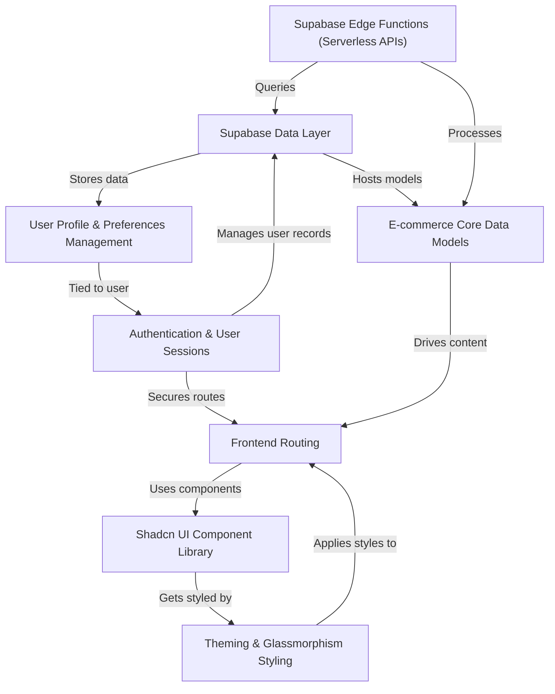

# Tutorial: clozet

CLOZET is an *ultra-futuristic e-commerce platform* that redefines online fashion shopping. It allows users to **securely browse and purchase a wide range of fashion products**, manage their personal profiles and preferences, and even experience innovative features like *AI virtual try-ons*. The project combines a cutting-edge design with robust backend data management and serverless functionality.

## Visual Overview

## Chapters

1. [Theming & Glassmorphism Styling
](01_theming___glassmorphism_styling_.md)
2. [Shadcn UI Component Library
](02_shadcn_ui_component_library_.md)
3. [Frontend Routing
](03_frontend_routing_.md)
4. [E-commerce Core Data Models
](04_e_commerce_core_data_models_.md)
5. [Supabase Data Layer
](05_supabase_data_layer_.md)
6. [Authentication & User Sessions
](06_authentication___user_sessions_.md)
7. [User Profile & Preferences Management
](07_user_profile___preferences_management_.md)
8. [Supabase Edge Functions (Serverless APIs)
](08_supabase_edge_functions__serverless_apis__.md)
